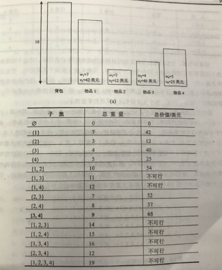
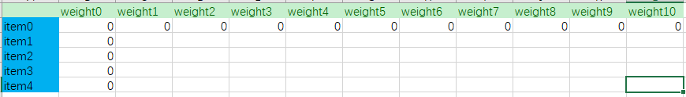
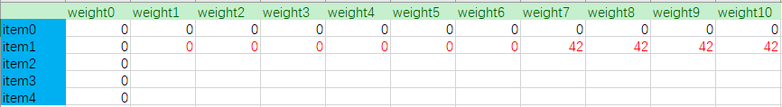

# KnapsackProblem(背包问题)

-------

## 问题
假定背包的最大容量为W。现在这里有N件物品，每件物品都有自己的价值和重量，将物品放入背包中使得背包内物品的总价值最大。

## 背包问题可以分为3种情况

* ZeroOnePack(01背包) ： 有 N 件物品和一个容量为 W 的背包（每件物品均只有一件）, 第 i 种物品的重量是 wi,价值是 vi。求解这些物品中最有价值的子集。
* CompletePack(完全背包) ： 有 N 件物品和一个容量为 W 的背包 （每种物品都有无限件可用），第 i 种物品的重量是 wi,价值是 vi。求解这些物品中最有价值的子集。
* MultiplePack(多重背包) ： 有 N 件物品和一个容量为 W 的背包 (第 i 种物品最多有 b 件可用，注: b 是一个有限的数) ，第 i 种物品的重量是 wi,价值是 vi。求解这些物品中最有价值的子集。

总而言之，01背包是每种物品只有一件，完全背包是每种物品是有无限件，而多重背包是每种物品是有限件。

## ZeroOnePack (01背包) 实现

* Exhaustive Search(穷举查找) ： 穷举查找需要考虑给定的 N 个物品集合的所有子集，为了找出可行的子集（也就是说，总重量不超过背包承重能力的子集），要计算出每个子集的总重量，然后在它们中间找到价值最大的子集。

* Dynamic Programming(动态规划) ： 推导出一个递推关系，用较小子实例的解的形式来表示背包问题的实例的解。我们可以这样认为由前 i 个物品（1<=i<=N）定义的实例，物品的重量分别为w1,w2,...,wi,价值分别为v1,v2,...,vi,背包的承重量为j (1<=j<=W)。设F(i,j) 为该实例的最优解的物品总价值。可以把前 i 个物品中能够放进承重量为 j 的背包的子集分成两个类别：包括第 i 个物品的子集和不包括第 i 个物品的子集。

	* 1.在不包括第 i 个物品的子集中，最优子集的价值是F(i-1,j);
	* 2.在包括第 i 个物品的子集中（即j-wi >=0），最优子集的价值是vi+F(i-1,j-wi)  

所以有： F(i,j) = max{F(i-1,j),vi+F(i-1,j-wi)} , j-wi>=0; 
&nbsp;&nbsp;&nbsp;&nbsp;&nbsp;&nbsp;&nbsp;&nbsp;&nbsp;&nbsp;&nbsp;&nbsp;&nbsp;&nbsp;&nbsp;&nbsp;&nbsp;&nbsp;&nbsp;&nbsp;&nbsp;&nbsp;&nbsp;= F(i-1,j) , j-wi<0

### 例如：
有物品1（w=7,v=42），物品2(w=3,v=12)，物品3(w=4,v=40)，物品4(w=5,v=25)各一件，背包承重量为10

即：W=10 , N=4 , V[]={42,12,40,25} , W[]={7,3,4,5}	

* 初始情况：对于背包承重量为0或没有物品的情况，其总价值为为0，即:

* 对于物品1，其重量是7，所以：

* 以此类推:

该算法的时间复杂度和空间复杂度都属于O(NW)
 

# 贡献人员名单
* [LiGang](https://github.com/angluaJs)

# CHANGELOG
* v1.0 2018/10/11 初稿（背包问题）