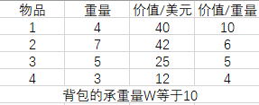
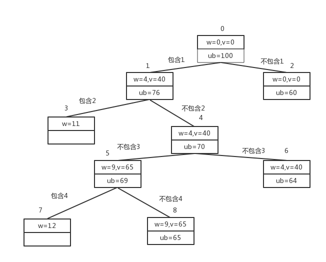
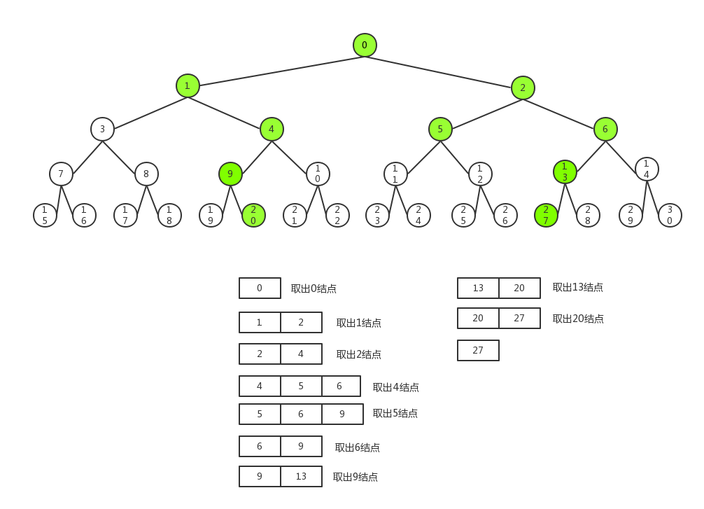

# 分支界限法

------

## 1.基本思想
分支界限法（Branch And Bound）是求解纯整数规划或混合整数规划问题的经典方法，在上世纪六十年代由Land Doig和Dakin等人提出。这种方法灵活且便于用计算机求解，目前已经成功运用于求解生产进度问题、旅行推销员问题、工厂选址问题、背包问题及分配问题等。算法基本思想如下：

1. 以广度优先或最小耗费（最大效益）优先的方式搜索问题的解空间树；
2. 分支界限法中，每一个活结点只有一次机会成为扩展结点，活结点一旦成为扩展结点，就一次性产生其所有儿子结点，其中导致不可行解或导致非最优解的儿子结点被舍弃，其余儿子结点被加入活结点表中；
3. 然后从活结点表中取下一结点成为当前扩展结点；
4. 重复上述结点扩展过程，直至到找到所需的解或活结点表为空为止。

## 2.常见的两种分支界限法
1. 队列式分支界限法 
	1. 按照队列先进先出（FIFO）原则选取下一个结点为扩展结点
	2. 从活结点表中取出结点的顺序与加入结点的顺序相同，因此活结点表的性质与队列相同
2. 优先队列分支界限法（代价最小或效益最大） 
	1. 每个结点都有一个对应的耗费或收益，以此决定结点的优先级
	2. 从优先队列中选取优先级最高的结点成为当前扩展结点
	3. 如果查找一个具有最小耗费的解：则活结点表可用小顶堆来构造活结点表，下一个扩展结点就是具有最小耗费的活结点
	4. 如果希望搜索一个具有最大收益的解：则可用大顶堆来构造活结点表，下一个扩张结点是具有最大收益的活结点

## 3.示例：0/1背包问题

### 优先队列分支界限法求解
给定n个重量为wi,价值为vi的物品（i=1,2，...,n）,以及一个承重量为W的背包，找出其中最有价值的物品子集，并且能够全部装入背包中。 

对于给定实例中物品，我按照降序对它们的“价值重量比”排序，即优先级。这样，第一个物品可以给出每单位重量的最佳回报，而最后一个物品只能给出每单位重量的最差回报： 
	v1/w1>=v2/w2>=...>=vi/wi 
我们把这个选择的总重量w和总价值v记录在节点中，有必要的话，任何向这个选择添加0个或者多个物品之后得到的子集的上界ub也会被记录下来。上界计算方法：把已选物品的总价值v,加上背包的剩余承重量W-w与剩下物品的最佳单位回报v(i+1)/w(i+1)的积，即ub=v+(W-w)(v(i+1)/w(i+1))

# 贡献人员名单
* [LiGang](https://github.com/angluaJs)

# CHANGELOG
* v1.0 2018/11/20 初稿（分支界限法）
