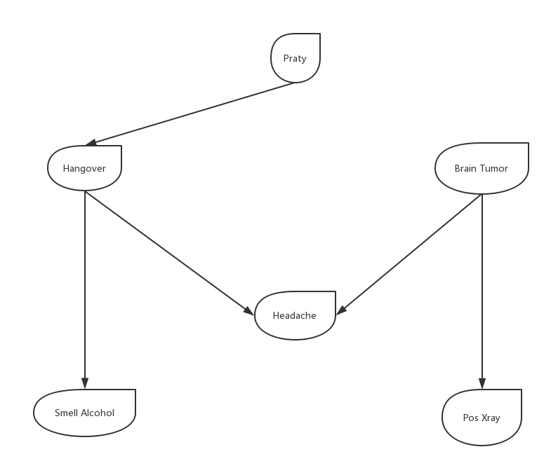

# 贝叶斯网络

## 1. 引例
        一个中学生回家后，其父亲猜测她参加了晚会，并喝了酒。第二天这个学生感到头疼，她的父母带她到医院做头部的X光检查。

        问题：如果他们的女儿头疼，患脑瘤的概率多大？如果又参加了晚会，那换脑瘤的概率又有多大？

## 2. 贝叶斯网络概述
        贝叶斯网络是一种概率网络，它是基于概率推理的图形化网络，而贝叶斯公式则是这个概率网络的基础。贝叶斯网络是基于概率推理的数学模型，所谓概率推理就是通过一些变量的信息来获取其他的概率信息的过程，基于概率推理的贝叶斯网络(Bayesian network)是为了解决不定性和不完整性问题而提出的，它对于解决复杂设备不确定性和关联性引起的故障有很大的优势，在多个领域中获得广泛应用。

### 2.1 贝叶斯网络定义
        一个贝叶斯网络定义包括一个有向无环图（DAG）和一个条件概率表集合。DAG中每一个节点表示一个随机变量，可以是可直接观测变量或隐藏变量，而有向边表示随机变量间的条件依赖；条件概率表中的每一个元素对应DAG中唯一的节点，存储此节点对于其所有直接前驱节点的联合条件概率。

### 2.2 贝叶斯网络的优越性
        1. 独立性好，对已有的信息要求低，速度快。
        2. 具有可理解性与逻辑性，是白盒模式，而神经网络是黑盒。
        3. 可以忽略次要矛盾而突出主要联系，有效避免过学习
        4. 推理结果说服力强。

## 3. 贝叶斯网络的三大议题

|  | P(PT)| P(BT)|
| ------ | ------ | ------ |
| True|  0.2| 0.001 |
| Falese| 0.8 | 0.999 |
&emsp;

| P(HO\|PT)| PT=True| PT=False|
| ------ | ------ | ------ |
| True| 0.7 |0  |
| Falese| 0.3 | 1 |
&emsp;

| P(SA\|HO) | HO=True| HO=False|
| ------ | ------ | ------ |
| True| 0.8 | 0.1 |
| Falese| 0.2 | 0.9 |
&emsp;

| P(PX\|BT)| BT=True| BT=False|
| ------ | ------ | ------ |
| True| 0.98 | 0.01 |
| Falese| 0.02 | 0.99 |
&emsp;

| P(HA\|HO,BT) | HO=T BT=T|HO=T BT=F|HO=F BT=T|HO=F BT=F|
| ------ | ------ | ------ | ------ | ------ |
| True| 0.99 | 0.7 |0.9 |0.02 |
| Falese| 0.01 | 0.3 | 0.1|0.98|
&emsp;

### 3.1 预测算法

        1. 计算HA的先验概率
                P(+HA) = P(+BT)P(+HO)*0.99 + P(+BT)P（-HO）*0.9 + P(-BT)P(+HO)*0.7 + P(-BT)P(-HO)*0.02 ≈ 0.116

        2. 计算已知参加晚会，第二天早晨有酒精味的概率
                P(+SA) = P(+HO)P(+SA|+HO) + P(-HO)P(+SA|-HO)
                =0.7*0.8 + 0.3*0.1
                =0.59

        3. 已知参加晚会，头疼的概率
                P(+HA) 
                = P(+HO)P(+BT)P(+HA|+HO+BT) + P(+HO)P(-BT)*0.7 + P(-HO)P(+BT)*0.9 + p(-HO)P(-BT)*0.02
                =0.496476

### 3.2 诊断算法

        1. 已知X光为阳性，求患脑瘤的概率
                P(+BT|+PX) 
                = P(+PX|+BT) * P(+BT)/P(+PX)
                =0.98*0.001/0.011
        
        2. 已知头疼，求脑瘤概率
                P(+HO)
                 = P(+HO|+PT) * P(+PT) + P(+HO|-PT) * P(-PT)
                 =0.7*0.2+0
                 =0.14

                P(+HA|+BT) 
                = p(+HO) * P(+HA|+BT,+HO) + p(-HO) * P(+HO|+BT,-HO)
                =0.14*0.99+0.86*0.9
                =0.9126

                p(-HA|+BT)
                ≈0.087 

| P(HA\|BT) | BT=T| BT=F|
| ------ | ------ | ------ |
| True| 0.913 | 0.115 |
| Falese| 0.087 | 0.885 |

                P(+BT|+HA) 
                = P(+HA|+BT) * P(+BT)/P(+HA)
                = 0.9126*0.001/0.116
                = 0.00767

### 3.3 综合算法
        1.已知参加晚会，有酒精味，宿醉的概率
                P(+SA) 
                = P(+SA|+HO) * P(+HO) + P(+SA|-HO)*P(-HO)
                =0.8*0.7+0.1*0.3
                =0.59

                P(+HO|+SA) 
                = P(+SA|+HO) * P(+HO) / P(+SA)
                = 0.8*0.7/0.59
                ≈0.94915

        2.已知酒精味，头疼，脑瘤的概率
                P(+HA|+BT) = P(+HA|+BT,+HO) * P(+HO) + P(+HA|+BT,-HO) * P(-HO)
                           = 0.9509
                
                P(+BT|+HA)
                = P(+HA|+BT) * P(+BT)/P(+HA)
                = 0.9509*0.001/0.405154296
                = 0.0023467423494

### 3.4 训练算法

|序号 | PT| HO|BT|HA|SA|PX|
| ------ | ------ | ------ |------ | ------ | ------ | ------ |
|1 | 1 |1  |0|1|1|0|
|2 | 0 | 0 |1|1|0|1|
|3 | 1 | 0 |0|0|0|0|
|4 | 1 | 1 |1|0|1|1|
|5 | 0 | 0 |0|0|0|1|
|6 | 1 | 1 |0|1|1|0|
|7 | 1 | 0 |1|0|1|0|
|8 | 0 | 0 |1|0|0|0|
|9 | 1 | 0 |0|0|1|0|
|10 | 1 | 1 |1|1|1|1|

## 贡献人员名单

名单按照字母顺序排序。

* [Gasen](https://github.com/GasenLi)

## CHANGELOG

* v1.0 2018/10/21 第一版