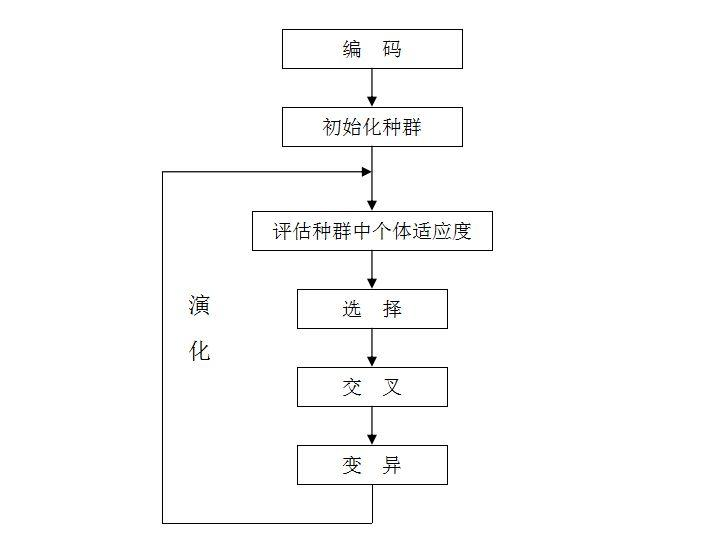

# 遗传算法

## 1. 概述

### 1.1 简述
        遗传算法（Genetic Algorithm）是一类借鉴生物界的进化规律（适者生存，优胜劣汰遗传机制）演化而来的随机化搜索方法。它是由美国的J.Holland教授1975年首先提出，其主要特点是直接对结构对象进行操作，不存在求导和函数连续性的限定；具有内在的隐并行性和更好的全局寻优能力；采用概率化的寻优方法，能自动获取和指导优化的搜索空间，自适应地调整搜索方向，不需要确定的规则。遗传算法的这些性质，已被人们广泛地应用于组合优化、机器学习、信号处理、图像处理、自适应控制和人工生命等领域。它是现代有关智能计算中的关键技术。

### 1.2 定义
>         遗传算法（Genetic Algorithm）是模拟达尔文生物进化论的自然选择和遗传学机理的生物进化过程的计算模型，是一种通过模拟自然进化过程搜索最优解的方法。

### 1.3 引例
        求 f(x) = x^3 x∈[0,31] 的最大值

## 2. 相关概念

* 基因型(genotype)：性状染色体的内部表现；

* 个体（individual）：指染色体带有特征的实体；

* 种群（population）：个体的集合，该集合内个体数称为种群

* 编码(coding)：DNA中遗传信息在一个长链上按一定的模式排列。遗传编码可看作从表现型到基因型的映射。

* 解码(decoding)：基因型到表现型的映射。

* 适应度(fitness)：度量某个物种对于生存环境的适应程度。

* 选择(selection)：以一定的概率从种群中选择若干个个体。一般，选择过程是一种基于适应度的优胜劣汰的过程。

* 交叉(crossover)：两个染色体的某一相同位置处DNA被切断，前后两串分别交叉组合形成两个新的染色体。也称基因重组或杂交；

* 变异(mutation)：复制时可能（很小的概率）产生某些复制差错，变异产生新的染色体，表现出新的性状。


## 3. 算法详解

### 3.1 基本思路



```
-----------------------------------------------------------------------------------------------
```

### 3.2 编码
        编码是应用遗传算法时要解决的首要问题，也是设计遗传算法时的一个关键步骤。编码方法影响到交叉算子、变异算子等遗传算子的运算方法，大很大程度上决定了遗传进化的效率。

        就像人类的基因有AGCT 4种碱基序列一样。不过在这里我们只用了0和1两种碱基,然后将他们串成一条链形成染色体。一个位能表示出2种状态的信息量，因此足够长的二进制染色体便能表示所有的特征。这便是二进制编码。如下：
        1110001010111

### 它由二进制符号0和1所组成的二值符号集。它有以下一些优点：

* 编码、解码操作简单易行
* 交叉、变异等遗传操作便于实现
* 合最小字符集编码原则
* 利用模式定理对算法进行理论分析。

### 3.2.1 编码长度
> 引例编码长度 : 2^5*2^10

```
-----------------------------------------------------------------------------------------------
```

### 3.3 初始化种群
> 每代的个数设为4

|个体Xi  | 基因序列| 解|
| ------ | ------ | ------ |
| x1| 01110 | 14 |
| x2| 11000 | 24 |
| x3| 10001 | 17 |
| x4| 00111 | 7 |

```
-----------------------------------------------------------------------------------------------
```


### 3.4 适应度与选择

#### 3.4.1 适应度 

        适应度函数也称评价函数，是根据目标函数确定的用于区分群体中个体好坏的标准。适应度函数总是非负的，而目标函数可能有正有负，故需要在目标函数与适应度函数之间进行变换。

        评价个体适应度的一般过程为：

        对个体编码串进行解码处理后，可得到个体的表现型。

        由个体的表现型可计算出对应个体的目标函数值。

        根据最优化问题的类型，由目标函数值按一定的转换规则求出个体的适应度。

> 设置适应度函数 fit(x) = x^3

#### 3.4.2 选择

        遗传算法中的选择操作就是用来确定如何从父代群体中按某种方法选取那些个体，以便遗传到下一代群体。选择操作用来确定重组或交叉个体，以及被选个体将产生多少个子代个体。

## 常用的选择算子：

* 轮盘赌选择（Roulette Wheel Selection）：是一种回放式随机采样方法。每个个体进入下一代的概率等于它的适应度值与整个种群中个体适应度值和的比例。选择误差较大。

* 随机竞争选择（Stochastic Tournament）：每次按轮盘赌选择一对个体，然后让这两个个体进行竞争，适应度高的被选中，如此反复，直到选满为止。

* 最佳保留选择：首先按轮盘赌选择方法执行遗传算法的选择操作，然后将当前群体中适应度最高的个体结构完整地复制到下一代群体中。


| 解 | 适应度 fit(x)| 选择概率|累计概率 |选择个数|
| ------ | ------ | ------ | ------ | ------ |
| 14| 196 | 0.18 | 0.18 | 1 |
| 24| 576 | 0.52 | 0.70 | 2 |
| 17| 289 | 0.26 | 0.96 | 1 |
|  7|  49 | 0.04 | 1.00 | 0 |

```
-----------------------------------------------------------------------------------------------
```

### 3.5 交叉
>遗传算法的交叉操作，是指对两个相互配对的染色体按某种方式相互交换其部分基因，从而形成两个新的个体。

## 适用于二进制编码个体或浮点数编码个体的交叉算子：

* 单点交叉（One-point Crossover）：指在个体编码串中只随机设置一个交叉点，然后再该点相互交换两个配对个体的部分染色体。

* 两点交叉与多点交叉：

        (1) 两点交叉（Two-point Crossover）：在个体编码串中随机设置了两个交叉点，然后再进行部分基因交换。

        (2) 多点交叉（Multi-point Crossover）

* 均匀交叉（也称一致交叉，Uniform Crossover）：两个配对个体的每个基因座上的基因都以相同的交叉概率进行交换，从而形成两个新个体。

* 算术交叉（Arithmetic Crossover）：由两个个体的线性组合而产生出两个新的个体。该操作对象一般是由浮点数编码表示的个体。

| 解 | 交配池| 交叉点 |下一子代| 子代十进制 | fit(x)|
| ------ | ------ | ------ | ------ | ------ | ------ |
| 14 | 01110 | 2 | 01000 | 8 | 512|
| 24 | 11000 | 2 | 11110 | 30| 27000| 
| 24 | 11000 | 4 | 11001 | 25| 15625|
| 17 | 10001 | 4 | 10000 | 16| 4096|

```
-----------------------------------------------------------------------------------------------
```

### 3.6 变异

>遗传算法中的变异运算，是指将个体染色体编码串中的某些基因座上的基因值用该基因座上的其它等位基因来替换，从而形成新的个体。

        例如下面这串二进制编码：

        101101001011001

        经过基因突变后，可能变成以下这串新的编码：

        001101011011001

## 以下变异算子适用于二进制编码和浮点数编码的个体：

* 基本位变异（Simple Mutation）：对个体编码串中以变异概率、随机指定的某一位或某几位仅因座上的值做变异运算。

* 均匀变异（Uniform Mutation）：分别用符合某一范围内均匀分布的随机数，以某一较小的概率来替换个体编码串中各个基因座上的原有基因值。（特别适用于在算法的初级运行阶段）

* 边界变异（Boundary Mutation）：随机的取基因座上的两个对应边界基因值之一去替代原有基因值。特别适用于最优点位于或接近于可行解的边界时的一类问题。

* 非均匀变异：对原有的基因值做一随机扰动，以扰动后的结果作为变异后的新基因值。对每个基因座都以相同的概率进行变异运算之后，相当于整个解向量在解空间中作了一次轻微的变动。

* 高斯近似变异：进行变异操作时用符号均值为Ｐ的平均值，方差为P**2的正态分布的一个随机数来替换原有的基因值。

|个体Xi  | 基因序列| 解|
| ------ | ------ | ------ |
| x1| 01001 | 9 |
| x2| 11110 | 30 |
| x3| 11001 | 25 |
| x4| 10010 | 18 |

```
-----------------------------------------------------------------------------------------------
```

### 3.7 代

> 设置迭代次数：50次

## 4. 实战

>  求解sinx^2+2*sinxcosx-3*cosx^2=1

## 贡献人员名单

名单按照字母顺序排序。

* [Gasen](https://github.com/GasenLi)

## CHANGELOG

* v1.0 2018/11/25 第一版