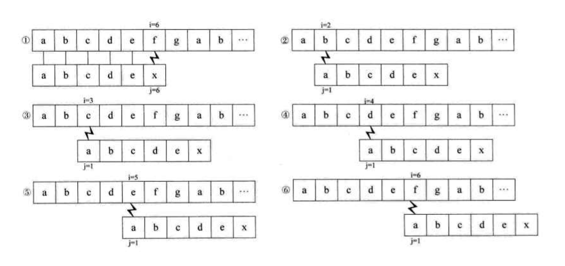
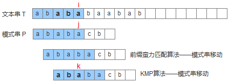
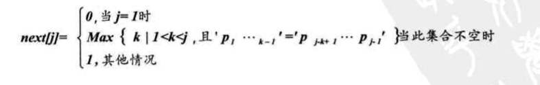

# KMP

## 1 前后缀不相等

当前后缀不相等的时候我们用常规的方法需要按图1-6一次匹配，如果用kmp则匹配步骤是1、6。

## 2 前后缀相等

## 3 求next数组

公式

公式解释

ps:next数组的起始下标是从1开始

* 当next[1] = 0代表需要匹配的字符串的首字符不能匹配，接下来的匹配的步骤就是用需要匹配的字符串的首字符与原字符串的下一个字符匹配。

* 当next[k] = n代表前缀与后缀的字符串匹配而且长为n。

* 当next[k] = 1代表接下下来的匹配需要子串的首字符与父串的当前匹配位置匹配。