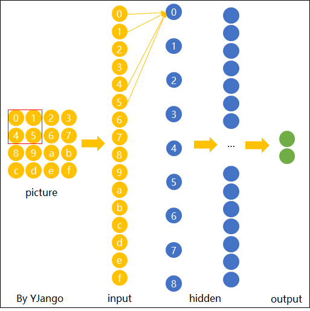

# 
 神经网络
* 前馈神经网络（BP）
* 卷积神经网络（CNN）
### 一、视觉感知
* 画面识别是什么任务?

     学习知识的首先第一步就是明确任务，清楚该知识的输入输出。卷积神经网络最初是服务于画面识别的，所以我们先来看看画面识别的实质是什么。

    1、苍蝇的视觉和人的视觉差异

    

    2、蛇的视觉和人的视觉差异

    

    通过上面的两组对比图可以知道，即便是相同的图片经过不同的视觉系统，也会得到不同的感知。
    这里引出一条知识：生物所看到的景象并非世界的原貌，而是长期进化出来的适合自己生存环境的一种感知方式。 蛇的猎物一般是夜间行动，所以它就进化出了一种可以在夜间也能很好观察的感知系统，感热。
    任何视觉系统都是将图像反光与脑中所看到的概念进行关联。

     

     所以画面识别实际上并非识别这个东西客观上是什么，而是寻找人类的视觉关联方式，并再次应用。 如果我们不是人类，而是蛇类，那么画面识别所寻找的 就和现在的不一样。

     * 画面识别实际上是寻找（学习）人类的视觉关联方式 ，并再次应用 

* 图片被识别成什么取决于哪些因素？
     
     1、老妇与少女

     

     请观察上面这张图片，你看到的是老妇还是少女？ 以不同的方式去观察这张图片会得出不同的答案。 图片可以观察成有大鼻子、大眼睛的老妇。也可以被观察成少女，但这时老妇的嘴会被识别成少女脖子上的项链，而老妇的眼睛则被识别为少女的耳朵。

     2、海豚与男女

     

     上面这张图片如果是成人观察，多半看到的会是一对亲热的男女。倘若儿童看到这张图片，看到的则会是一群海豚（男女的轮廓是由海豚构造出的）。所以，识别结果受年龄，文化等因素的影响，换句话说：
     图片被识别成什么不仅仅取决于图片本身，还取决于图片是如何被观察的。

     3、图像表达
     我们知道了“画面识别是从大量的x、y数据中寻找人类的视觉关联方式。并再次应用。其x是输入，表示所看到的东西。y输出，表示该东西是什么。
     在自然界中，x是物体的反光，那么在计算机中，图像又是如何被表达和存储的呢？

     

     图像在计算机中是一堆按顺序排列的数字，数值为0到255。0表示最暗，255表示最亮。 你可以把这堆数字用一个长长的向量来表示，也就是tensorflow的mnist教程中784维向量的表示方式。 然而这样会失去平面结构的信息，为保留该结构信息，通常选择矩阵的表示方式：28x28的矩阵。

     上图是只有黑白颜色的灰度图，而更普遍的图片表达方式是RGB颜色模型，即红（Red）、绿（Green）、蓝（Blue）三原色的色光以不同的比例相加，以产生多种多样的色光。

     这样，RGB颜色模型中，单个矩阵就扩展成了有序排列的三个矩阵，也可以用三维张量去理解，其中的每一个矩阵又叫这个图片的一个channel。

     在电脑中，一张图片是数字构成的“长方体”。可用 宽width, 高height, 深depth 来描述，如图。
    
    

    画面识别的输入是shape为(width, height, depth)的三维张量。
    接下来要考虑的就是该如何处理这样的“数字长方体”。

* 画面不变性

    在决定如何处理“数字长方体”之前，需要清楚所建立的网络拥有什么样的特点。 我们知道一个物体不管在画面左侧还是右侧，都会被识别为同一物体，这一特点就是不变性（invariance），如下图所示。

     

     我们希望所建立的网络可以尽可能的满足这些不变性特点。

     为了理解卷积神经网络对这些不变性特点的贡献，我们将用不具备这些不变性特点的前馈神经网络来进行比较。

### 二、图片识别--前馈神经网络
* 方便起见，我们用depth只有1的灰度图来举例。 想要完成的任务是：在宽长为4x4的图片中识别是否有下图所示的“横折”。 图中，黄色圆点表示值为0的像素，深色圆点表示值为1的像素。 我们知道不管这个横折在图片中的什么位置，都会被认为是相同的横折。

     

* 若训练前馈神经网络来完成该任务，那么表达图像的三维张量将会被摊平成一个向量，作为网络的输入，即(width, height, depth)为(4, 4, 1)的图片会被展成维度为16的向量作为网络的输入层。再经过几层不同节点个数的隐藏层，最终输出两个节点，分别表示“有横折的概率”和“没有横折的概率”，如下图所示。

     

* 下面我们用数字（16进制）对图片中的每一个像素点（pixel）进行编号。 当使用右侧那种物体位于中间的训练数据来训练网络时，网络就只会对编号为5,6,9,a的节点的权重进行调节。 若让该网络识别位于右下角的“横折”时，则无法识别。

     

     * 解决办法是用大量物体位于不同位置的数据训练，同时增加网络的隐藏层个数从而扩大网络学习这些变体的能力。

     * 然而这样做十分不效率，因为我们知道在左侧的“横折”也好，还是在右侧的“横折”也罢，大家都是“横折”。 为什么相同的东西在位置变了之后要重新学习？有没有什么方法可以将中间所学到的规律也运用在其他的位置？ 换句话说，也就是让不同位置用相同的权重

### 四、图片识别--卷积神经网络
* 卷积神经网络就是让权重在不同位置共享的神经网络。

* 局部连接：
     * 在卷积神经网络中，我们先选择一个局部区域，用这个局部区域去扫描整张图片。 局部区域所圈起来的所有节点会被连接到下一层的一个节点上。

     * 为了更好的和前馈神经网络做比较，我将这些以矩阵排列的节点展成了向量。 下图展示了被红色方框所圈中编号为0,1,4,5的节点是如何通过w1,w2,w3,w4连接到下一层的节点0上的。

          

     * 这个带有连接强弱的红色方框就叫做filter 或 kernel 或 feature detector。。 而filter的范围叫做filter size，这里所展示的是2x2的filter size。

          

     * 第二层的节点0的数值就是局部区域的线性组合，即被圈中节点的数值乘以对应的权重后相加。 用x表示输入值，y表示输出值，用图中标注数字表示角标，则下面列出了两种计算编号为0的输出值的表达式。

     * 注：在局部区域的线性组合后，也会和前馈神经网络一样，加上一个偏移量b

          

* 空间共享
     * 当filter扫到其他位置计算输出节点y时，w1,w2,w3,w4,包括b时是共用的

     * 下面这张动态图展示了当filter扫过不同区域时，节点的链接方式。 动态图的最后一帧则显示了所有连接。 可以注意到，每个输出节点并非像前馈神经网络中那样与全部的输入节点连接，而是部分连接。 这也就是为什么大家也叫前馈神经网络（feedforward neural network）为fully-connected neural network。 图中显示的是一步一步的移动filter来扫描全图，一次移动多少叫做stride。

          

* 输出表达
     * 如先前在图像表达中提到的，图片不用向量去表示是为了保留图片平面结构的信息。 同样的，卷积后的输出若用上图的排列方式则丢失了平面结构信息。 所以我们依然用矩阵的方式排列它们，就得到了下图所展示的连接。

          

     * 这也就是你们在网上所看到的下面这张图。在看这张图的时候请结合上图的连接一起理解，即输入（绿色）的每九个节点连接到输出（粉红色）的一个节点上的。

          

     * 经过一个feature detector计算后得到的粉红色区域也叫做一个“Convolved Feature” 或 “Activation Map” 或 “Feature Map”。

     * Depth维的处理

     * 现在我们已经知道了depth维度只有1的灰度图是如何处理的。 但前文提过，图片的普遍表达方式是下图这样有3个channels的RGB颜色模型。 当depth为复数的时候，每个feature detector是如何卷积的？

          

     * 现象：
          * 2x2所表达的filter size中，一个2表示width维上的局部连接数，另一个2表示height维上的局部连接数，并却没有depth维上的局部连接数，是因为depth维上并非局部，而是全部连接的。

          * 在2D卷积中，filter在张量的width维, height维上是局部连接，在depth维上是贯串全部channels的。

     * 类比：
          * 想象在切蛋糕的时候，不管这个蛋糕有多少层，通常大家都会一刀切到底，但是在长和宽这两个维上是局部切割。

     * 下面这张图展示了，在depth为复数时，filter是如何连接输入节点到输出节点的。 图中红、绿、蓝颜色的节点表示3个channels。 黄色节点表示一个feature detector卷积后得到的Feature Map。 其中被透明黑框圈中的12个节点会被连接到黄黑色的节点上。

          * 在输入depth为1时：被filter size为2x2所圈中的4个输入节点连接到1个输出节点上。
          * 在输入depth为3时：被filter size为2x2，但是贯串3个channels后，所圈中的12个输入节点连接到1个输出节点上。

          * 在输入depth为n时：2×2×n个输入节点连接到1个输出节点上。

               

* 形状、概念抓取
     * 知道了每个filter在做什么之后，我们再来思考这样的一个filter会抓取到什么样的信息。
          * 假设第一组过滤器7×7的曲线检测器，作为局限过滤器，他将有一个像素结构，在曲线形状旁边时会产生更高的数值（！切记，我们所讨论的过滤器不过是一组数值！）

          

          * 左图：过滤器的像素表示；右图：曲线检测器过滤器的可视化；对比两图可以看到数值和形状的对应

          * 回到数学角度来看这一过程。当我们将过滤器置于输入内容的左上角时，它将计算过滤器和这一区域像素值之间的点积。拿一张需要分类的照片为例，将过滤器放在它的左上角。

          

          * 切记，我们要做的是将过滤器与图像的原始像素值相乘。

          

          * 简单来说，如果输入图像上某个形状看起来很像过滤器表示的曲线，那么所有点积加在一起将会得出一个很大的值！让我们看看移动过滤器时会发生什么。

          

          
          

     * 我们知道不同的形状都可由细小的“零件”组合而成的。比如下图中，用2x2的范围所形成的16种形状可以组合成格式各样的“更大”形状。

     * 卷积的每个filter可以探测特定的形状。又由于Feature Map保持了抓取后的空间结构。若将探测到细小图形的Feature Map作为新的输入再次卷积后，则可以由此探测到“更大”的形状概念。 比如下图的第一个“大”形状可由2,3,4,5基础形状拼成。第二个可由2,4,5,6组成。第三个可由6,1组成。

          

     * 除了基础形状之外，颜色、对比度等概念对画面的识别结果也有影响。卷积层也会根据需要去探测特定的概念。

     * 可以从下面这张图中感受到不同数值的filters所卷积过后的Feature Map可以探测边缘，棱角，模糊，突出等概念。

          

     * 如我们先前所提，图片被识别成什么不仅仅取决于图片本身，还取决于图片是如何被观察的。

     * 而filter内的权重矩阵W是网络根据数据学习得到的，也就是说，我们让神经网络自己学习以什么样的方式去观察图片。

     * 拿老妇与少女的那幅图片举例，当标签是少女时，卷积网络就会学习抓取可以成少女的形状、概念。 当标签是老妇时，卷积网络就会学习抓取可以成老妇的形状、概念。

     * 下图展现了在人脸识别中经过层层的卷积后，所能够探测的形状、概念也变得越来越抽象和复杂。

          

* 多filters
     * 每个filter可以抓取探测特定的形状的存在。 假如我们要探测下图的长方框形状时，可以用4个filters去探测4个基础“零件”。

          

          

     * 因此我们自然而然的会选择用多个不同的filters对同一个图片进行多次抓取。观看），同一个图片，经过两个（红色、绿色）不同的filters扫描过后可得到不同特点的Feature Maps。 每增加一个filter，就意味着你想让网络多抓取一个特征。

          

     * 这样卷积层的输出也不再是depth为1的一个平面，而是和输入一样是depth为复数的长方体。

     * 如下图所示，当我们增加一个filter（紫色表示）后，就又可以得到一个Feature Map。 将不同filters所卷积得到的Feature Maps按顺序堆叠后，就得到了一个卷积层的最终输出。

          

