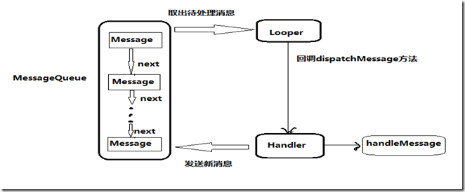

# 异步消息处理机制与Android服务

---------

## 1. 解析异步消息处理机制
	
Android 中的异步消息处理机制主要由4个部分组成：Message 、Handler、 MessageQueue 和 Looper。

* **Message:**
Message 是在线程之间传递的消息，它可以在内部携带少量的信息，用于在不同线程之间交换数据。比如使用 Message 的 What 字段，除此之外还可以使用 arg1 和 arg2 字段来携带一些整数型数据，使用 obj 字段携带一个 Object 对象。

* **Handler:**
Handler 顾名思义也就是处理者的意思，它主要是用于发送和处理消息的。发送消息一般是使用 Handler 的 sendMessage() 方法，而发出的消息经过一系列辗转处理后，最终会传递到 Handler 的 handleMessage() 方法中。

* **MessageQueue:**
MessageQueue 是消息队列的意思，它主要是用于存放所有通过 Handler 发送的消息。这部分消息会一直存放在于消息队列中，等待被处理。每个线程中只会有一个 MessageQueue 对象。

* **Looper:**
Looper 是每个线程中的 MessageQueue 的管家，调用 Looper 的 loop() 方法后，就会进入到一个无限循环当中，然后每当方法 MessageQueue 中存放一条消息，就会将它取出，并传递到 Handler 的 handleMessage() 方法中。每个线程中也只会有一个 Looper 对象。

所以一个完整的异步消息处理的流程是：首先需要在主线程当中创建一个 Handler 对象，并重写 handleMessage() 方法。然后当子线程中需要进行操作时，就创建一个 Message 对象，并通过 Handler 将这条消息发送出去。之后这条消息会被添加到 MessageQueue 的队列中等待被处理，而 Looper 则会一直尝试从 MessageQueue 中取出待处理消息，最后分发回 Handler 的 handleMessage() 方法中。由于 Handler 是在主线程中创建的，所以此时 handleMessage() 方法中的代码也会在主线程中运行。整个异步消息处理机制的流程示意图如下图所示：

## 2. Android 服务

服务（Service）是一个一种可以在后台长时间运行操作而没有用户界面的应用组件。服务的运行不依赖于任何用户界面，即使程序被切换到后台，或者用户打开了另外一个应用程序，服务仍然能够保持正常运行。值得注意的是：服务并不是运行在一个独立的进程当中的，而是依赖于创建服务时所在的应用程序进程。当某个应用程序进程被杀掉时，所有依赖于该进程的服务也会停止运行。此外，组件可以绑定到服务，以与之进行交互，甚至是执行进程间通信（IPC）。例如，服务可以处理网络事务、播放音乐、执行文件I/O或与内容提供程序交互，而所有这一切均可在后台通信。

### 2.1 启动服务

首先要创建服务，必须创建 Service 的子类（或使用它的一个子类，如IntentService）。在实现中，我们需要重写一些回调方法，以处理服务生命周期的某些关键过程。关于这几个方法说明如下：

* **onBind():**
当另外一个组件想通过 bindService() 与服务绑定（例如执行RPC）时，系统将调用此方法。在此方法的实现中，必须返回一个 IBinder 接口实现类，供客服端用来与服务进行通信。无论是启动状态还是绑定转态，此方法必须重写，但在启动状态的情况下直接返回Null.

* **onCreate():**
首次创建服务时，系统将调用此方法来执行一次性设置程序（在调用 onStartCommand() 或 onBind() 之前）。如果服务已在运行，则不会调用此方法，该方法只调用一次。

* **onStartCommand():**
当另一个组件（如 Activity）通过调用 startService() 请求启动服务时，系统将调用此方法。一旦执行此方法，服务即会启动并可在后台无限期运行。 如果自己实现此方法，则需要在服务工作完成后，通过调用 stopSelf() 或 stopService() 来停止服务。（在绑定状态下，无需实现此方法）

* **onDestory():**
当服务不再使用且将被销毁时，系统将调用此方法。服务应该实现此方法来清理所有资源，如线程、注册的侦听器、接收器等，这是服务接收的最后一个调用。

### 2.2 绑定服务

绑定服务是 Service 的另一种。当其他组件（如Activity）绑定到服务时（有时我们需要从 Activity 组件中去调用 Serivce 中的方法，此时 Activity 以绑定的方式挂靠到 Service 后，我们就可以轻松的访问到 Service 中指定的方法），组件（如 Activity ）可以向 Service 发送请求，或者调用 Service 的方法，此时被绑定的 Service 会接受信息并响应，甚至可以通过绑定服务进行执行进程间的通信。与启动服务不同的是绑定服务的生命周期通常只在为其他应用组件(如 Activity )服务时处于活动状态，不会无限期在后台运行，也就是说宿主(如 Activity )解除绑定后，绑定服务就会被销毁。在提供绑定的服务时，我们必须提供一个 IBinder 接口实现类，该类用以提供客户端用来与服务交互的编程接口，该接口可以通过三种方法定义接口：

* **扩展 Binder 类:**
如果服务是提供给自有应用专用的，并且Service(服务端)与客户端相同的进程中运行（常见情况），则应通过扩展 Binder 类并从 onBind() 返回它的一个实例来创建接口。客户端收到 Binder 后，可利用它直接访问 Binder 实现中以及Service 中可用的公共方法。如果我们的服务只是自有应用的后台工作线程，则优先采用这种方法。 不采用该方式创建接口的唯一原因是，服务被其他应用或不同的进程调用。

* **使用 Messenger :**
Messenger可以翻译为信使，通过它可以在不同的进程中共传递Message对象(Handler中的Messager，因此 Handler 是 Messenger 的基础)，在Message中可以存放我们需要传递的数据，然后在进程间传递。如果需要让接口跨不同的进程工作，则可使用 Messenger 为服务创建接口，客户端就可利用 Message 对象向服务发送命令。同时客户端也可定义自有 Messenger，以便服务回传消息。这是执行进程间通信 (IPC) 的最简单方法，因为 Messenger 会在单一线程中创建包含所有请求的队列，也就是说Messenger是以串行的方式处理客户端发来的消息，这样我们就不必对服务进行线程安全设计了。

* **使用 AIDL ：**
由于Messenger是以串行的方式处理客户端发来的消息，如果当前有大量消息同时发送到Service(服务端)，Service仍然只能一个个处理，这也就是Messenger跨进程通信的缺点了，因此如果有大量并发请求，Messenger就会显得力不从心了，这时AIDL（Android 接口定义语言）就派上用场了， 但实际上Messenger 的跨进程方式其底层实现 就是AIDL，只不过android系统帮我们封装成透明的Messenger罢了 。因此，如果我们想让服务同时处理多个请求，则应该使用 AIDL。 在此情况下，服务必须具备多线程处理能力，并采用线程安全式设计。使用AIDL必须创建一个定义编程接口的 .aidl 文件。Android SDK 工具利用该文件生成一个实现接口并处理 IPC 的抽象类，随后可在服务内对其进行扩展。

#### 2.2.1 扩展 Binder 类：

如果我们的服务仅供本地应用使用，不需要跨进程工作，则可以实现自有的 Binder 类，让客户端通过该类直接访问服务中的公共方法。其步骤如下：

* 1. 创建 BindService 服务端，继承自 Service 并在类中，创建一个实现 IBinder 接口的实例对象并提供公共方法给客户端调用；
* 2. 从onBind() 方法返回此 Binder 实例；
* 3. 在客户端中，从 onServiceConnected() 回调方法接收 Binder ，并适用提供的方法调用绑定服务。

在客服端中我们创建一个 ServiceConnection 对象，该代表与服务的连接，它只有两个方法，onServiceConnected 和 onServiceDisconnected ，其含义如下：

* **onServiceConnected(ComponentName name, IBinder service)：**系统会调用该方法以传递服务的　onBind() 方法返回的 IBinder。其中service便是服务端返回的IBinder实现类对象，通过该对象我们便可以调用获取LocalService实例对象，进而调用服务端的公共方法。而ComponentName是一个封装了组件(Activity, Service, BroadcastReceiver, or ContentProvider)信息的类，如包名，组件描述等信息，较少使用该参数。
* **onServiceDisconnected(ComponentName name) ：**Android 系统会在与服务的连接意外中断时（例如当服务崩溃或被终止时）调用该方法。注意:当客户端取消绑定时，系统“绝对不会”调用该方法。

在onServiceConnected()被回调前，我们还需先把当前Activity绑定到服务上，绑定服务是通过通过bindService()方法，解绑服务则使用unbindService()方法，这两个方法解析如下： 

* **bindService(Intent service, ServiceConnection conn, int flags)：**该方法执行绑定服务操作，其中 Intent 是我们要绑定的服务的意图，而ServiceConnection代表与服务的连接，flags则是指定绑定时是否自动创建 Service 。0代表不自动创建, BIND\_AUTO\_CREATE 则代表自动创建。
* **unbindService(ServiceConnection conn)：**该方法执行解除绑定的操作。

所以整个流程是：当我们第一次点击绑定服务时，Service 服务端的 onCreate() 、onBind() 方法会一次调用，此时客户端的 ServiceConnection下的 onServiceConnected() 被调用并返回 Binder 对象，此时客户端便持有了 Service 的实例对象，也就可以调用 Service 类中声明的公共方法了。
更值得注意的是，我们多次调用 bindService 方法绑定 Service 服务端，而 Service 得 onBind 方法只调用了一次，那就是在第一次调用bindService 时才会回调 onBind 方法。接着我们点击获取服务端的数据。并且多次绑定只需一次解绑即可。此情景也就说明了绑定状态下的 Service 生命周期方法的调用依次为 onCreate()、onBind()、onUnBind()、onDestroy()。

# 贡献人员名单
* [LiGang](http://example.com/)

# CHANGELOG
* v1.0 2018/09/16 初稿（异步消息处理机制与Android服务）