# 查找树

## 1. 树

&emsp;&emsp;树状图是一种数据结构，它是由n（n>=1）个有限结点组成一个具有层次关系的集合。把它叫做“树”是因为它看起来像一棵倒挂的树，也就是说它是根朝上，而叶朝下的。它具有以下的特点：
每个结点有零个或多个子结点；没有父结点的结点称为根结点；每一个非根结点有且只有一个父结点；除了根结点外，每个子结点可以分为多个不相交的子树；

&emsp;&emsp;数据结构中有很多树的结构，其中包括二叉树、二叉搜索树、2-3树、红黑树等等。本文中对数据结构中常见的几种树的概念和用途进行了汇总。

## 2. 二叉树

### 2.1 二叉树概述

&emsp;&emsp;在计算机科学中，二叉树是每个结点最多有两个子树的树结构。通常子树被称作“左子树”（left subtree）和“右子树”（right subtree）。二叉树常被用于实现二叉查找树和二叉堆。

#### 2.1.1 满二叉树

&emsp;&emsp;一棵深度为k，且有2^k-1个节点的二叉树，称为满二叉树。这种树的特点是每一层上的节点数都是最大节点数。

#### 2.1.2 完全二叉树

&emsp;&emsp;在一棵二叉树中，除最后一层外，若其余层都是满的，并且最后一层或者是满的，或者是在右边缺少连续若干节点，则此二叉树为完全二叉树。具有n个节点的完全二叉树的深度为floor(log2n)+1。深度为k的完全二叉树，至多有2^k-1个叶子节点，至多有2^k-1个节点。

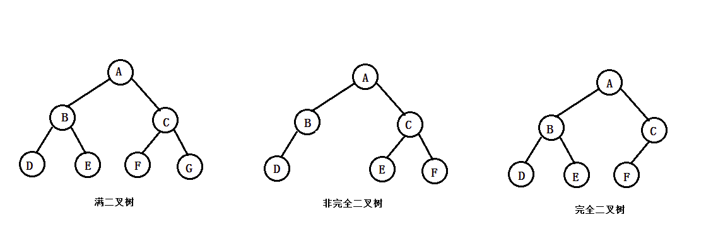

### 2.2 二叉树的遍历

&emsp;&emsp;所谓遍历(Traversal)是指沿着某条搜索路线，依次对树中每个结点均做一次且仅做一次访问。访问结点所做的操作依赖于具体的应用问 题。 遍历是二叉树上最重要的运算之一，是二叉树上进行其它运算之基础。

    遍历口诀：
    根左右（前） 
    左根右（中） 
    左右根（后） 

    有没有发现其实就是‘根’的位置发生了改变，前就是‘根’在前，中在中，后在后。 
    按照这个口诀遍历下来就是所谓的前中后遍历。

#### 2.2.1 二叉树遍历示例

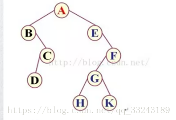

    前序遍历：ABCDEFGHK

    中序遍历：BDCAEHGKF

    后序遍历：DCBHKGFEA

### 2.2.2 三种遍历的作用

    前：深度搜索
    中：有序序列
    后：逆波兰式 计算算数表达式树

## 3 二叉排序树

    二叉排序树或者是一棵空树，或者是具有下列性质的二叉树：
    （1）若左子树不空，则左子树上所有结点的值均小于它的根结点的值；
    （2）若右子树不空，则右子树上所有结点的值均大于或等于它的根结点的值；
    （3）左、右子树也分别为二叉排序树；

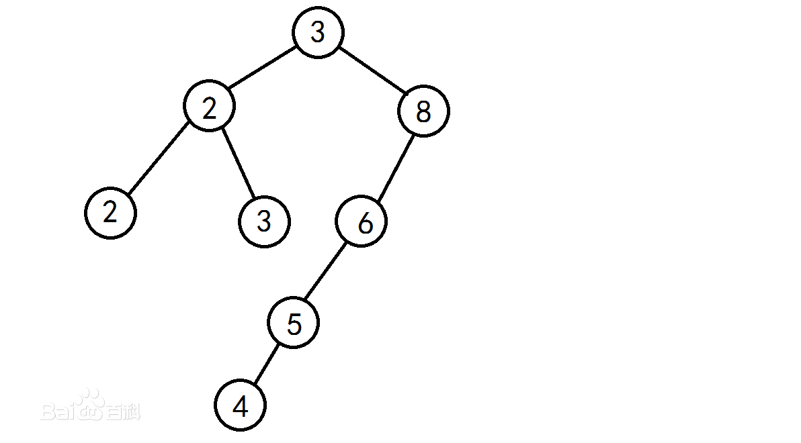

&emsp;&emsp;每个结点的C(i)为该结点的层次数。最坏情况下，当先后插入的关键字有序时，构成的二叉排序树蜕变为单支树，树的深度为其平均查找长度(n+1)/2(和顺序查找相同），最好的情况是二叉排序树的形态和折半查找的判定树相同，其平均查找长度和log 2 (n)成正比。

## 4 平衡二叉树-AVL

&emsp;&emsp;我们知道，对于一般的二叉搜索树（Binary Search Tree），其期望高度（即为一棵平衡树时）为log2n，其各操作的时间复杂度O(log2n)同时也由此而决定。但是，在某些极端的情况下（如在插入的序列是有序的时），二叉搜索树将退化成近似链或链，此时，其操作的时间复杂度将退化成线性的，即O(n)。我们可以通过随机化建立二叉搜索树来尽量的避免这种情况，但是在进行了多次的操作之后，由于在删除时，我们总是选择将待删除节点的后继代替它本身，这样就会造成总是右边的节点数目减少，以至于树向左偏沉。这同时也会造成树的平衡性受到破坏，提高它的操作的时间复杂度。于是就有了我们下边介绍的平衡二叉树。

&emsp;&emsp;AVL树本质上还是一棵二叉搜索树，它的特点是： [1] 
1.本身首先是一棵二叉搜索树。
2.带有平衡条件：每个结点的左右子树的高度之差的绝对值（平衡因子）最多为1。
也就是说，AVL树，本质上是带了平衡功能的二叉查找树（二叉排序树，二叉搜索树）。

这里我们关注的是两个变化很大的操作：插入和删除

### 4.1 单旋转

对应情况：LL型平衡旋转与RR型平衡旋转

### 4.2 双旋转

对应情况：LR型平衡旋转与RL型平衡旋转

## 5 2-3树

2-3查找树允许树中的一个结点保存多个键，一棵2-3查找树或为一棵空树，或由以下结点组成：

    　　2-结点，含有一个键（及其对应的值）和两条链接，左链接指向的2-3树中的键都小于该结点，右链接指向的2-3树中的键都大于该结点。

    　　3-结点，含有两个键（及其对应的值）和三条链接，左链接指向的2-3树中的键都小于该结点，中链接指向的2-3树中的键都位于该结点的两个键之间，右链接指向的2-3树中的键都大于该结点。

&emsp;&emsp;一棵完美平衡的2-3查找树中的所有空链接到根结点的距离都应该是相同的。这里我们用2-3树指代一棵完美平衡的2-3查找树，如下图所示。

### 5.1 2-3树的插入

向2-结点中插入新键

向一棵只含有一个3-结点的树中插入新键

向一个父节点为2-结点的3-结点中插入新键

向一个父节点为3-结点的3-结点中插入新键

### 5.2 2-3树的删除

#### 5.2.1 删除非叶子节点key

&emsp;&emsp;使用中序遍历下的直接后继节点key来覆盖当前节点key，再删除用来覆盖的后继节点key

#### 5.2.2 删除叶子节点key

1. 当前节点不是2-节点，直接删除key

2. 当前节点的双亲节点是2-节点、兄弟节点是3-节点，将双亲节点移动到当前位置，再将兄弟节点中最接近当前位置的key移动到双亲节点中

2. 当前节点的双亲节点是2-节点、兄弟节点也是2-节点，先通过移动兄弟节点的中序遍历直接后驱到兄弟节点，以使兄弟节点变为3-节点；再进行1的操作

3. 当前节点的双亲节点是3-节点，拆分双亲节点使其成为2-节点，再将再将双亲节点中最接近的一个拆分key与中孩子合并，将合并后的节点作为当前节点

4. 2-3树是一颗满二叉树，将2-3树层树减少，并将兄弟节点合并到双亲节点中，同时将双亲节点的所有兄弟节点合并到双亲节点的双亲节点中，如果生成了-4节点，再分解4-节点即可

## 6 红黑树

### 6.1 引言
&emsp;&emsp;尽管我们可以用不同的数据类型表示2-结点和3-结点并写出变换所需的代码，这样我们需要维护两种不同类型的结点，将被查找的键和结点中的每个键进行比较，将链接和其他信息从一种结点复制到另一种结点，将结点从一种数据类型转换到另一种数据类型等等。实现这些不仅需要大量的代码，而且它们所产生的额外开销可能会使算法比标准的二叉查找树更慢。幸运的是我们可以使用红黑树来解决这个问题，它以二叉树的形式实现了2-3树。

### 6.2 定义

红黑树的一种定义是含有红黑链接并满足下列条件的二叉查找树：

    　　红链接均为左链接（左偏红黑树）；
    　　没有任何一个结点同时和两条红链接相连；
    　　该树是完美黑色平衡的，即任意空链接到根节点的路径上的黑链接数量相同。

&emsp;&emsp;满足这样定义的红黑树和相应的2-3树是一一对应的。
&emsp;&emsp;如果我们将一棵红黑树中的红链接画平，那么所有的空链接到根节点的距离都将是相同的。如果我们将有红链接相连的结点合并，得到的就是一棵2-3树。
&emsp;&emsp;相反，如果将一棵2-3树中的3-结点画作由红色左链接相连的两个2-结点，那么不会存在能够和两条红链接相连的结点，且树必然是完美黑色平衡的。
&emsp;&emsp;红黑树既是二叉查找树，也是2-3树。因此如果我们能够在保持一一对应关系的基础上实现2-3树的插入算法，那么我们就能够将两个算法的优点结合起来：二叉查找树中简洁高效的查找算法和2-3树中高效的平衡插入算法。

### 6.3 红黑树的旋转

&emsp;&emsp;首先，假设我们有一条红色的右链接需要被转化为左链接，这个操作叫左旋转。它只是将用两个键中的较小者作为根节点变为将较大者作为根节点。

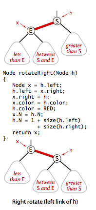

### 6.4 红黑树的插入

向2-结点中插入新键

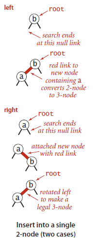

向树底部的2-结点插入新键

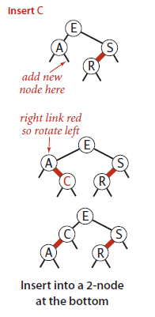

向一个3-结点中插入新键（这种情况又可分为三种子情况：新键大于树中的两个键，小于树中的两个键，或是在两者之间。）

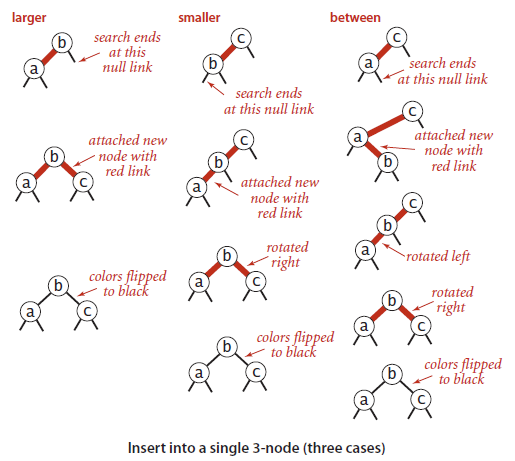

向树底部的3-结点插入新键

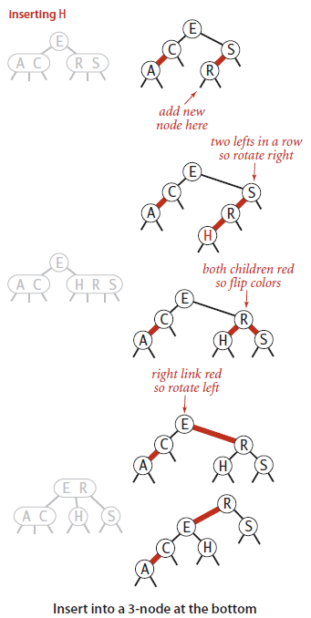

### 6.5 红黑树的删除

参照2-3树的删除

## 7 B树家族

### 7.1 B树（B-树）

&emsp;&emsp;1970年，R.Bayer和E.mccreight提出了一种适用于外查找的树，它是一种平衡的多叉树，称为B树（或B-树、B_树）。

&emsp;&emsp;一棵m阶B树(balanced tree of order m)是一棵平衡的m路搜索树。它或者是空树，或者是满足下列性质的树：

    1. 根结点至少有两个子女；
    2. 每个非根节点所包含的关键字个数 j 满足：
        ┌m/2┐ - 1 <= j <= m - 1  (┐代表向上取整)
    3. 除根结点以外的所有结点（不包括叶子结点）的度数正好是关键字总数加1，故内部子树个数 k 满足：┌m/2┐ <= k <= m ；
    4. 所有的叶子结点都位于同一层。
    5. 每个结点中关键字从小到大排列，并且当该结点的孩子是非叶子结点时，该k-1个关键字正好是k个孩子包含的关键字的值域的分划。
    6. 因为叶子结点不包含关键字，所以可以把叶子结点看成在树里实际上并不存在外部结点，指向这些外部结点的指针为空，叶子结点的数目正好等于树中所包含的关键字总个数加1。

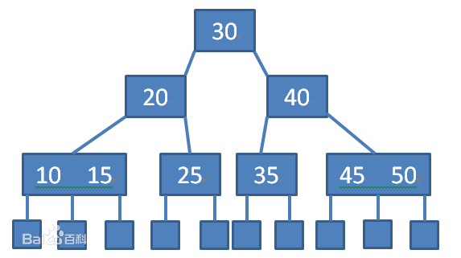

### 7.1.1 B树的添加

&emsp;&emsp;若在一个包含j<m-1个关键字的结点中插入一个新的关键字，则把新的关键字直接插入该结点即可；但若把一个新的关键字插入到包含m-1（m为B-树的阶）个关键字的结点中，则将引起结点的分裂。在这种情况下，要把这个结点分裂为两个，并把中间的一个关键字（中间的关键字满足：左边的小于该关键字；右边的大于该关键字；故正好可以作为双亲）拿出来插到该结点的双亲结点中去，双亲结点也可能是满的，就需要再分裂、再往上插，从而可能导致B-树可能朝着根的方向生长。

eg: (插入44)

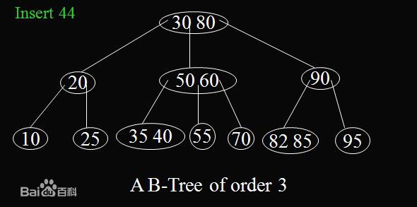
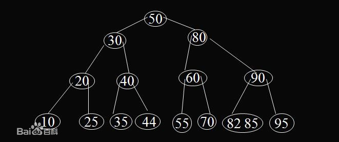

### 7.1.2 B树的删除

&emsp;&emsp;当从B-树中删除一个关键字Ki时，总的分为以下两种情况：
1. 如果该关键字所在的结点不是最下层的非叶子结点，则先需要把此关键字与它在B-树中后继对换位置，即以指针Pi所指子树中的最小关键字Y代替Ki，然后在相应的结点中删除Y。

2. 如果该关键字所在的结点正好是最下层的非叶子结点，这种情况下，会有以下两种可能：

    Ⅰ. 若该关键字Ki所在结点中的关键字个数不小于┌m/2┐，则可以直接从该结点中删除该关键字和相应指针即可。

    Ⅱ. 若该关键字Ki所在结点中的关键字个数小于┌m/2┐，则直接从结点中删除关键字会导致此结点中所含关键字个数小于┌m/2┐-1 。这种情况下，需考察该结点在B树中的左或右兄弟结点，从兄弟结点中移若干个关键字到该结点中来（这也涉及它们的双亲结点中的一个关键字要作相应变化），使两个结点中所含关键字个数基本相同；但如果其兄弟结点的关键字个数也很少，刚好等于┌m/2┐-1 ，这种移动则不能进行，这种情形下，需要把删除了关键字Ki的结点、它的兄弟结点及它们双亲结点中的一个关键字合并为一个结点。

eg: 
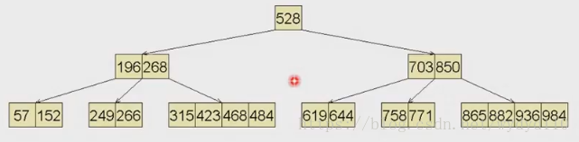

删除249
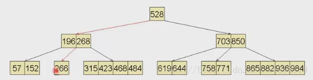

不急于合并，先左顾右盼，向有兄弟接一个关键码
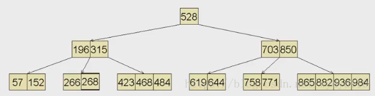

接着删除619
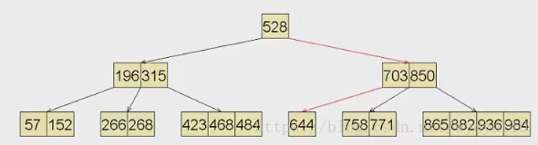

664没有左兄弟，右兄弟处于即将下溢的边缘临界状态，旋转技巧已不适用，选择合并。
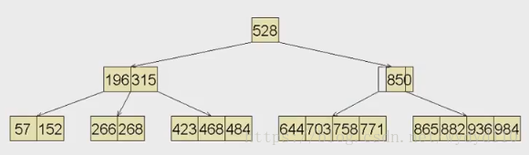

此时，父节点发生了下溢，继续合并。
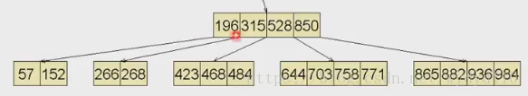

整棵B树的高度降低了一层，这时B树高度得以下降的唯一可能。

### 7.1.3 B树总结

&emsp;&emsp;B树被设计成相对矮宽，而对B树的访问是由一系列的外存操作和内存操作交替组成的。有多少外存操作，就有多少内存操作。但要使外存操作的代价与内存操作的代价大致相当。B树能做到，而AVL却做不到。

&emsp;&emsp;水平方向：对应与每个节点的内部搜索，在内存（RAM）中进行。
&emsp;&emsp;垂直方向：对应于磁盘（Disk）操作。树中每下降一层，就要付出一次IO操作的代价。

### 7.1.3.1 磁盘简介

&emsp;&emsp;计算机存储设备一般分为两种：内存储器(main memory)和外存储器(external memory)。 内存存取速度快，但容量小，价格昂贵，而且不能长期保存数据(在不通电情况下数据会消失)。外存储器—磁盘是一种直接存取的存储设备(DASD)。它是以存取时间变化不大为特征的。可以直接存取任何字符组，且容量大、速度较其它外存设备更快。

&emsp;&emsp;磁盘是一个扁平的圆盘(与电唱机的唱片类似)。盘面上有许多称为磁道的圆圈，数据就记录在这些磁道上。磁盘可以是单片的，也可以是由若干盘片组成的盘组，每一盘片上有两个面。如下图中所示的4片盘组为例，一共有8个面可以用来保存信息。

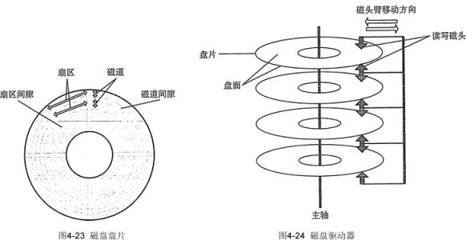

### 7.2 B+树

&emsp;&emsp;B+树是B-树的变体，也是一种多路搜索树，它与B-树的区别在于：

       1.非叶子结点的子树指针与关键字个数相同。

       2.非叶子结点的子树指针P[i]，指向关键字值属于[K[i], K[i+1])的子树。（B-树是开区间）

       3.为所有叶子结点增加一个链指针。

       4.所有关键字都在叶子结点出现。

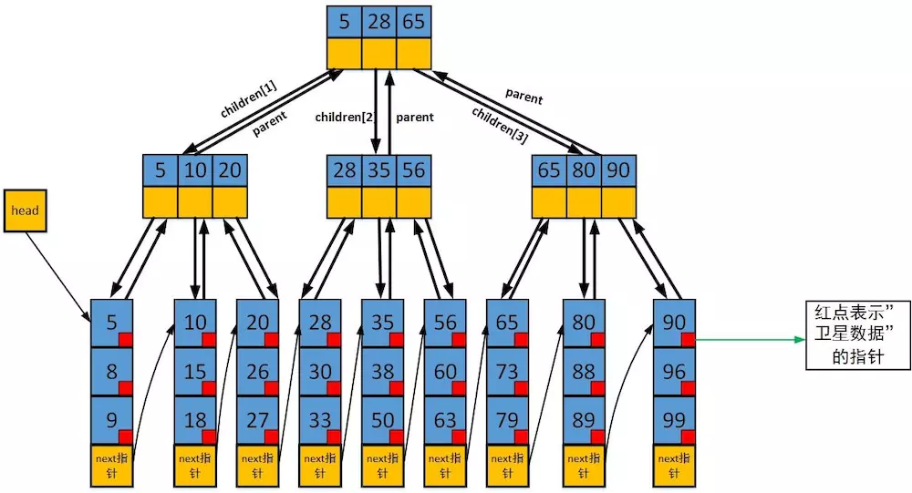

#### 7.2.1 B+树的添加

&emsp;&emsp;各种资料上B+树的定义各有不同，一种定义方式是关键字个数和孩子结点个数相同。这里我们采取维基百科上所定义的方式，即关键字个数比孩子结点个数小1，这种方式是和B树基本等价的。

B+树的添加与删除和B树原理相同，区别在于索引部分的变化。

eg1:（插入15） 

eg2:（插入7） 

#### 7.2.2 B+树的删除

eg3:（删除15） 

eg4:（删除7） 

### 7.2.3 B+树的总结

B+的特性：

    1.所有关键字都出现在叶子结点的链表中（稠密索引），且链表中的关键字恰好是有序的。

    2.不可能在非叶子结点命中。

    3.非叶子结点相当于是叶子结点的索引（稀疏索引），叶子结点相当于是存储（关键字）数据的数据层。

    4.更适合文件索引系统:
        Ⅰ. 非叶子节点不会带上ROWID，这样每个叶子节点就更小,从而每次IO的层数就更大，从而减少IO次数。

        Ⅱ. 叶子节点之间通过指针来连接，范围扫描将十分简单，而对于B树来说，则需要在叶子节点和内部节点不停的往返移动。

MySQL与：

&emsp;&emsp;从Mysql（Inoodb）的角度来看，B+树是用来充当索引的，一般来说索引非常大，尤其是关系性数据库这种数据量大的索引能达到亿级别，所以为了减少内存的占用，索引也会被存储在磁盘上。那么Mysql如何衡量查询效率呢？磁盘IO次数，B-树（B类树）的特定就是每层节点数目非常多，层数很少，目的就是为了就少磁盘IO次数，当查询数据的时候，最好的情况就是很快找到目标索引，然后读取数据，使用B+树就能很好的完成这个目的，但是B-树的每个节点都有data域（指针），这无疑增大了节点大小，说白了增加了磁盘IO次数（磁盘IO一次读出的数据量大小是固定的，单个数据变大，每次读出的就少，IO次数增多，一次IO多耗时啊！），而B+树除了叶子节点其它节点并不存储数据，节点小，磁盘IO次数就少。这是优点之一。
另一个优点是什么，B+树所有的Data域在叶子节点，一般来说都会进行一个优化，就是将所有的叶子节点用指针串起来。这样遍历叶子节点就能获得全部数据，这样就能进行区间访问啦。

&emsp;&emsp;至于MongoDB为什么使用B-树而不是B+树，可以从它的设计角度来考虑，它并不是传统的关系性数据库，而是以Json格式作为存储的nosql，目的就是高性能，高可用，易扩展。首先它摆脱了关系模型，上面所述的优点2需求就没那么强烈了，其次Mysql由于使用B+树，数据都在叶节点上，每次查询都需要访问到叶节点，而MongoDB使用B-树，所有节点都有Data域，只要找到指定索引就可以进行访问，无疑单次查询平均快于Mysql（但侧面来看Mysql至少平均查询耗时差不多）。

总体来说，Mysql选用B+树和MongoDB选用B-树还是以自己的需求来选择的。

### 7.3 B* 树

&emsp;&emsp;B* 树是B+树的变体，在B+树的非根和非叶子结点再增加指向兄弟的指针。B* 树定义了非叶子结点关键字个数至少为(2/3)·M，即块的最低使用率为2/3（代替B+树的1/2）。

#### 7.3.1 B* 树的分裂

&emsp;&emsp;B*树的分裂：当一个结点满时，如果它的下一个兄弟结点未满，那么将一部分数据移到兄弟结点中，再在原结点插入关键字，最后修改父结点中兄弟结点的关键字（因为兄弟结点的关键字范围改变了）；如果兄弟也满了，则在原结点与兄弟结点之间增加新结点，并各复制1/3的数据到新结点，最后在父结点增加新结点的指针；

## 8 单词查找树

### 8.1 Hash树

&emsp;&emsp;在计算机科学中，哈希树（或哈希特里）是一种持久性数据结构，可用于实现集合和映射，旨在替换纯函数式编程中的哈希表。 在其基本形式中，哈希树在trie中存储其键的哈希值（被视为位串），其中实际键和（可选）值存储在trie的“最终”节点中

<B>哈希树的理论基础</B>

    质数分辨定理 

    n个不同的质数可以“分辨”的连续整数的个数和他们的乘积相等。“分辨”就是指这些连续的整数不可能有完全相同的余数序列。 

&emsp;&emsp;例如： 从2起的连续质数，连续10个质数就可以分辨大约M(10) =2*3*5*7*11*13*17*19*23*29= 6464693230 个数，已经超过计算机中常用整数（32bit）的表达范围。连续100个质数就可以分辨大约M(100) = 4.711930 乘以10的219次方。 

&emsp;&emsp;而按照目前的CPU水平，100次取余的整数除法操作几乎不算什么难事。在实际应用中，整体的操作速度往往取决于节点将关键字装载内存的次数和时间。一般来说，装载的时间是由关键字的大小和硬件来决定的；在相同类型关键字和相同硬件条件下，实际的整体操作时间就主要取决于装载的次数。他们之间是一个成正比的关系。

#### 8.1.1 Hash树的插入

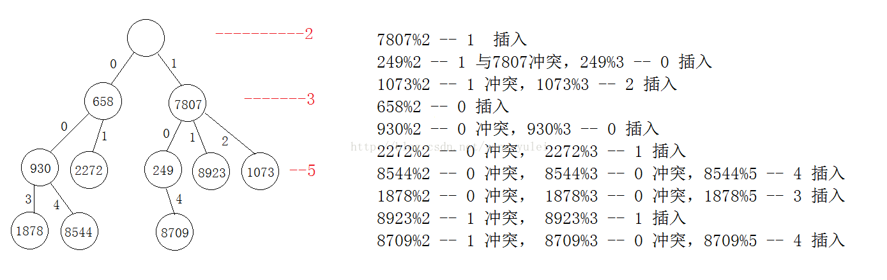

#### 8.1.2 Hash树的查找

&emsp;&emsp;哈希树的节点查找过程和节点插入过程类似，就是对关键字用质数序列取余，根据余数确定下一节点的分叉路径，直到找到目标节点。 
如上图，最小”哈希树(HashTree)在从4G个对象中找出所匹配的对象，比较次数不超过10次。也就是说：最多属于O(10)。在实际应用中，调整了质数的范围，使得比较次数一般不超过5次。也就是说：最多属于O(5)。因此可以根据自身需要在时间和空间上寻求一个平衡点。

#### 8.1.3 Hash树的删除

&emsp;&emsp;哈希树的节点删除过程也很简单，哈希树在删除的时候，并不做任何结构调整。 
只是先查到到要删除的节点，然后把此节点的“占位标记”置为false即可（即表示此节点为空节点，但并不进行物理删除）。

### 8.2 字典树（Tire树）

&emsp;&emsp;又称单词查找树，Trie树，是一种树形结构，是一种哈希树的变种。典型应用是用于统计，排序和保存大量的字符串（但不仅限于字符串），所以经常被搜索引擎系统用于文本词频统计。它的优点是：利用字符串的公共前缀来减少查询时间，最大限度地减少无谓的字符串比较，查询效率比哈希树高。

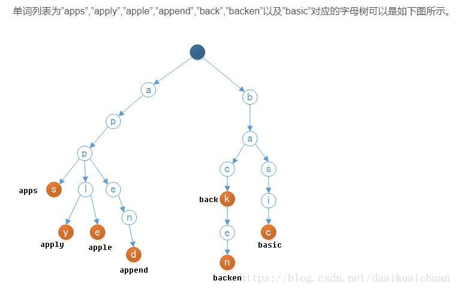

#### 8.2.1 字典树的优点

1. 利用字符串的公共前缀来减少查询时间，最大限度地减少无谓的字符串比较，查询效率比哈希树高。

2. Trie树中不同的关键字不会产生冲突。

3. 自带排序功能（类似Radix Sort），中序遍历trie可以得到排序。

#### 8.2.2 字典树的缺点

1. 虽然不同单词共享前缀，但其实trie是一个以空间换时间的算法。其每一个字符都可能包含至多字符集大小数目的指针。

2. 如果数据存储在外部存储器等较慢位置，Trie会较hash速度慢（hash访问O(1)次外存，Trie访问O(树高)）。

3. 长的浮点数等会让链变得很长。可用bitwise trie改进。

#### 8.2.3 字典树的改进

1. 按位 Trie 树（Bitwise Trie）：原理上和普通 Trie 树差不多，只不过普通 Trie 树存储的最小单位是字符，但是 Bitwise Trie 存放的是位而已。位数据的存取由 CPU 指令一次直接实现，对于二进制数据，它理论上要比普通 Trie 树快。

2. 节点压缩。

    Ⅰ. 分支压缩：对于稳定的 Trie 树，基本上都是查找和读取操作，完全可以把一些分支进行压缩。例如，前图中最右侧分支的 inn 可以直接压缩成一个节点“inn”，而不需要作为一棵常规的子树存在。Radix 树（基数树）就是根据这个原理来解决 Trie 树过深问题的。
    
    Ⅱ. 节点映射表：这种方式也是在 Trie 树的节点可能已经几乎完全确定的情况下采用的，针对 Trie 树中节点的每一个状态，如果状态总数重复很多的话，通过一个元素为数字的多维数组（比如 Triple Array Trie）来表示，这样存储 Trie 树本身的空间开销会小一些，虽说引入了一张额外的映射表。

#### 8.2.4 字典树的应用

1. 字符串检索：检索、查询功能是Trie树最原始功能，思路就是从根节点开始一个一个字符进行比较。

2. Trie树常被搜索引擎用于文本词频统计。

3. Trie树可以对大量字符串按字典序进行排序。

4. 前缀匹配 ：如当输入一个网址，可以自动搜索出可能的选择。当没有完全匹配的搜索结果，可以返回前缀最相似的可能。

### 8.3 后缀树

&emsp;&emsp;后缀树（Suffix tree）是一种数据结构，能快速解决很多关于字符串的问题。后缀树的概念最早由Weiner 于1973年提出，既而由McCreight 在1976年和Ukkonen在1992年和1995年加以改进完善。

&emsp;&emsp;后缀树，就是把一串字符的所有后缀保存并且压缩的字典树。相对于字典树来说，后缀树并不是针对大量字符串的，而是针对一个或几个字符串来解决问题。

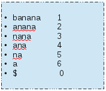
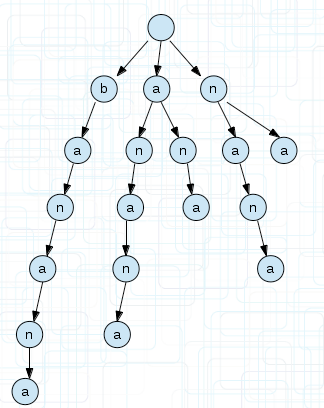

#### 8.3.1 后缀树的压缩

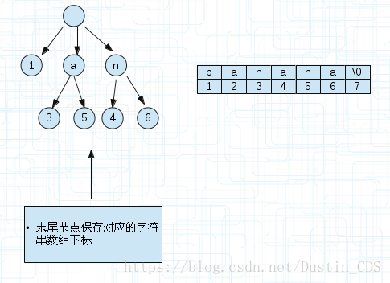

&emsp;&emsp;上图中的banana这个后缀串，直接可以用1来表示起点，终点是默认的。 上图的a节点后面有两个节点标记3和5是右边字符数组的下标，对应着a->3-7，a->5-7。因为a是共有的前缀。

#### 8.3.2 后缀树的应用

1. 判断字符串s1是否是字符串s2的子串

2. 获得字符串s1在字符串s2中重复的次数

3. 两个字符串s1，s2的最长公共部分

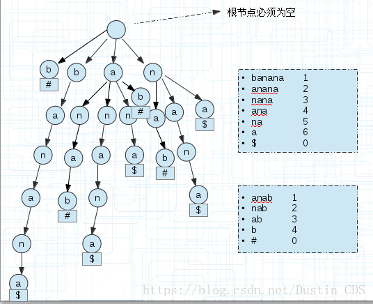

&emsp;&emsp;遍历每个后缀串，如果其引用计数为1则直接跳过，因为不可能有两个子串存放在这里，当引用计数>1时，往下遍历，直到分叉分别记录子串的符号，如果不同，说明他们是不同字符串的，记录已经匹配的值即可，若相同继续下一次遍历。上图的ana部分，到ana时，子串$结束，然后继续向下，子串anab以#结束，那么匹配了ana。

#### 8.3.3 最长回文串

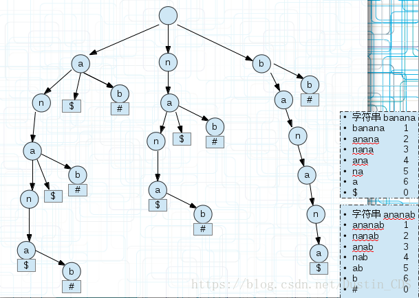

&emsp;&emsp;回文串有一个定义就是正反相同，也就是正着和反着可以重和在一起，那么我们直接看这棵广义后缀树的共同前缀即可，每个banana的子串和ananab的子串重合的部分都是回文串，我们只需要找到最长的即可。比如上面的anana，从后面不同的标记可以看出两个字符串的某个后缀都有这个前缀，能完美重合到一起。即它是回文串。 记录Max，每次找到一个回文串比较即可。

## 贡献人员名单

名单按照字母顺序排序。

* [Gasen](https://github.com/GasenLi)

## CHANGELOG

* v1.0 2019/04/20 第一版