# mysql索引之B-/B+树

## 1 什么是索引

 索引是帮助MySQL高效获取数据的数据结构。
### 1.1 mysql的存储引擎

mysql4.0开始使用InnoDB存储引擎，InnoDB存储引擎支持B-tree和B+tree索引，InnoDB之前的存储引擎是MyISAM，MyISAM也是支持B+Tree。

## 2 为什么会选择B-tree存储外存的索引

**我们从几种树的结构来观察**

### 2.1 二叉查找树（BST）

 特点：当前节点的值大于左孩子节点的值，小于右孩子饥饿点的值。当阶数过大时查询效率就低了由此平衡二叉树产生了。

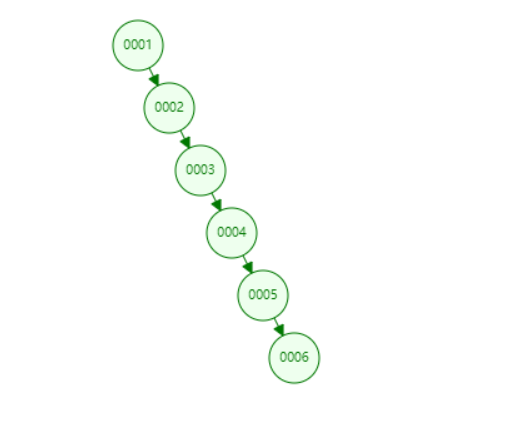

如果我们查找6，会IO 6次。
 

### 2.2 平衡二叉树(AVL Tree)

 特点：任何节点的两个子树的高度差<=1。当插入或者删除一个节点时回导致树失去平衡，失去平衡时的状态分为：LL(左左)、RR(右右)、LR(左右)、RL(右左)4种状态。我们需要通过一次旋转或者两次旋转使数从新达到平衡。

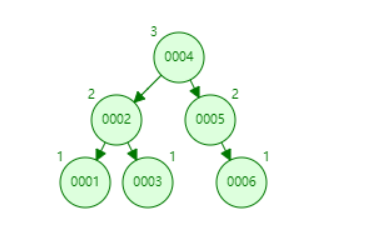

如果我们查找6，会IO 3次。

**重新找回平衡策略**

此处省略

### 2.3 红黑树

红黑树的特点：

（1）每个节点或者是黑色，或者是红色。

（2）根节点是黑色。

（3）每个叶子节点（NIL）是黑色。 [注意：这里叶子节点，是指为空(NIL或NULL)的叶子节点！]

（4）如果一个节点是红色的，则它的子节点必须是黑色的。

（5）从一个节点到该节点的子孙节点的所有路径上包含相同数目的黑节点。

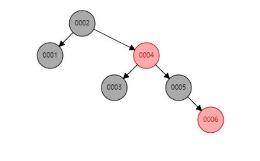

如果我们查找6，会IO 4次。

### 2.4 B-Tree

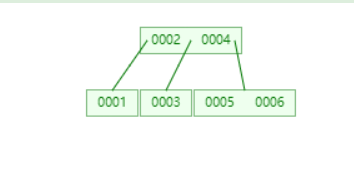

如果我们查找6，会IO 2次。

#### 2.41 一棵m阶的B-Tree有如下特性 

1. 每个节点最多有m个孩子。 
2. 除了根节点和叶子节点外，其它每个节点至少有Ceil(m/2)个孩子。 
3. 若根节点不是叶子节点，则至少有2个孩子 
4. 所有叶子节点都在同一层，且不包含其它关键字信息 
5. 每个非终端节点包含n个关键字信息（P0,P1,…Pn, k1,…kn） 
6. 关键字的个数n满足：ceil(m/2)-1 <= n <= m-1 
7. ki(i=1,…n)为关键字，且关键字升序排序。

#### 2.42 B-tree的搜索过程

#### 2.43 B-tree的节点的添加

1 找到插入的位置

2 插入后判断结点空间是否满了，如果节点满了中间关键字上移到父节点中，中间关键右边的节点分裂成一个新的节点，如果上移后父节点空间也满了那么按同样的方式分裂父节点，以此类推。

#### 2.44 B-tree的节点删除

**删除的大体步骤分两步**

1. 在树中查找被删关键字K所在的地点
2. 进行删去K的操作

**删除的详细过程**

若删除的是非叶节点，则用K的中序前趋(或后继)K'取代K，然后从叶子中删去K'。从叶子*x开始删去某关键字K的 **三种情形**为：

**情形一**：若x->keynum(关键字个数)>Min(最小关键字)，则只需删去K及其右指针(*x是叶子，K的右指针为空)即可使删除操作结束。

若我们删除8

删除前(树的阶数为5，最小关键字数为2,最大关键字数为4)

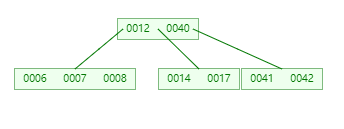

删除后(树的阶数为5，最小关键字数为2,最大关键字数为4)

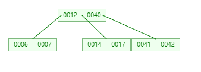

**情形二**：若x->keynum=Min，该叶子中的关键字个数已是最小值，删K及其右指针后会破坏B-树的性质(6)。**若x的左(或右)邻兄弟结点y中的关键字数目大于Min**，则将y中的最大(或最小)关键字上移至双亲结点parent中，而将parent中相应的关键字下移至x中。显然这种移动使得双亲中关键字数目不变；y被移出一个关键字，故其keynum减1，因它原大于Min，故减少1个关键字后keynum仍大于等于Min；而x中已移入一个关键字，故删K后x中仍有Min个关键字。涉及移动关键字的三个结点均满足B-树的性质(6)。 移动完成后，删除过程亦结束。

若我们删除7

删除前(树的阶数为5，最小关键字数为2,最大关键字数为4)

删除后(树的阶数为5，最小关键字数为2,最大关键字数为4)

删除的过程为：

1. 将14上移到父节节点
2. 将12下移到左孩子节节点中
3. 删除7节点

**情形三**：若x及其相邻的左右兄弟(也可能只有一个兄弟)中的关键字数目均为最小值Min，则上述的移动操作就不奏效，此时须x和左或右兄弟合并。不妨设x有右邻兄弟y(对左邻兄弟的讨论与此类似)，在x中删去K后，将双亲结点parent中介于x和y之间的关键字K，作为中间关键字，与并x和y中的关键字一起"合并"为一个新的结点取代x和y。因为x和y原各有Min个关键字，从双亲中移入的K'抵消了从x中删除的K，故新结点中恰有2Min(即2「m/2」-2≤m-1)个关键字，没有破坏B-树的性质(5)。但由于K'从双亲中移到新结点后，相当于从parent中删去了K'，若parent->keynum原大于Min，则删除操作到此结束；否则，同样要通过移动parent的左右兄弟中的关键字或将parent与其左右兄弟合并的方法来维护B-树性质。**最坏情况下，合并操作会向上传播至根**，当根中只有一个关键字时，合并操作将会使根结点及其两个孩子合并成一个新的根，从而使整棵树的高度减少一层。 

若我们删除12

删除前(树的阶数为5，最小关键字数为2,最大关键字数为4)

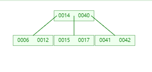

删除后(树的阶数为5，最小关键字数为2,最大关键字数为4)

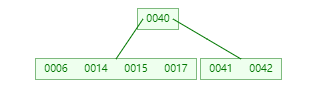

删除的过程为：

1. 删除12
2. 将14作为其两个左右子节点的中间关键字，与两个子节点合并成新的子节点。

加载中...

##2.5 B+Tree

B+Tree相对于B-Tree有几点不同：

1. 非叶子节点只存储键值信息。

2. 所有叶子节点之间都有一个链指针。

3. 数据记录都存放在叶子节点中。

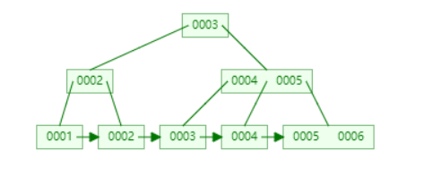

# 3 InnoDB与MyISAM索引的细节

## 使用InnoDB引擎的表
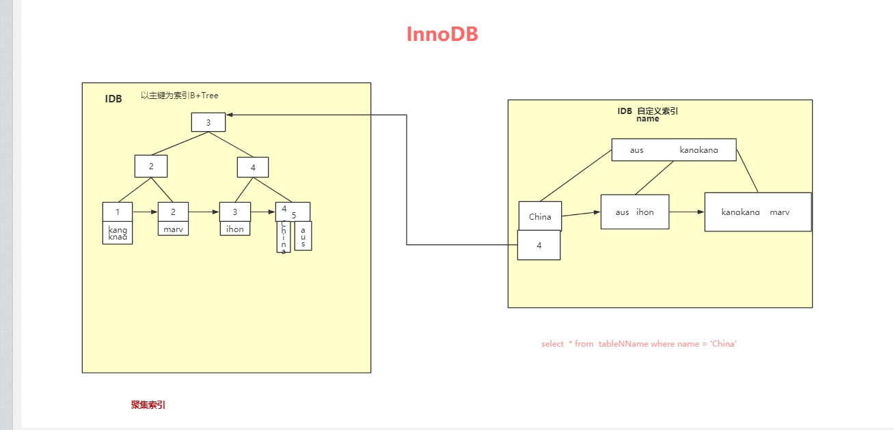

## 使用MyISAM引擎的表
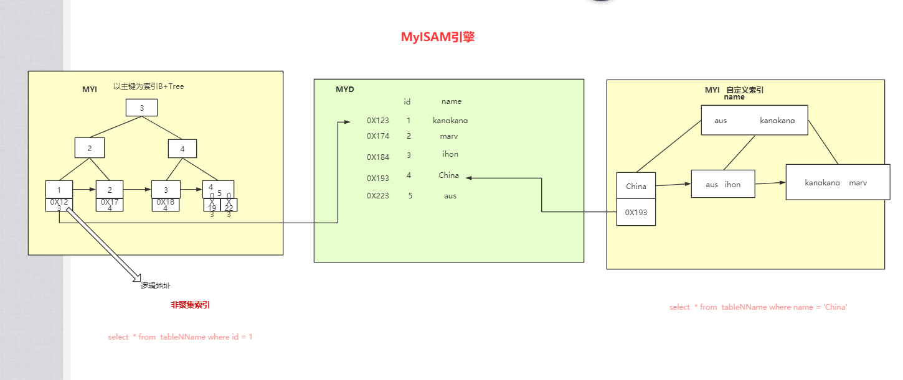

[参考文档](https://www.cnblogs.com/vianzhang/p/7922426.html)

[B-tree演示一波](https://www.cs.usfca.edu/~galles/visualization/BTree.html)

## 贡献人员名单

* [forestMr](https://github.com/forestMr)

## CHANGELOG

* v1.0 2019/03/17

