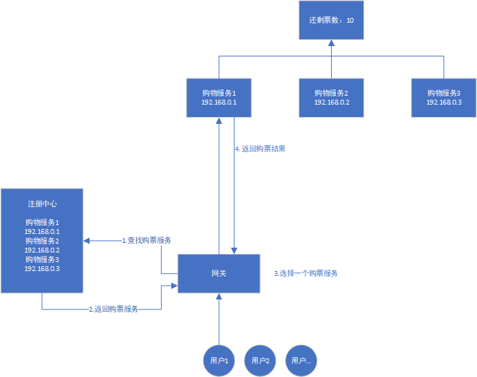

# Zookeeper 实现分布式锁

## 摘要

>在分布式的环境中，如何实现分布式协同，访问临界资源。

## 继往开来

Q： Java 中如何实现有序的访问临界资源呢？

Java 中有 synchonized 关键字。

Q：为什么加了这个关键字就能实现有序访问临界资源？

每个 java 对象都有一个对象头区域。

对象头布局:

| 对象头结构             | 说明                                                         |
| ---------------------- | ------------------------------------------------------------ |
| Mark Word              | 存储对象的hashCode、锁信息或分代年龄或GC标志等信息           |
| Class Metadata Address | 类型指针指向对象的类元数据，JVM通过这个指针确定该对象是哪个类的实例。 |

Mark Word在默认情况下存储着对象的HashCode、分代年龄、锁标记位等以下是32位JVM的Mark Word默认存储结构

| 锁状态   | 25bit        | 4bit         | 1bit是否是偏向锁 | 2bit 锁标志位 |
| -------- | ------------ | ------------ | ---------------- | ------------- |
| 无锁状态 | 对象HashCode | 对象分代年龄 | 0                | 01            |

有锁情况下:


通过上面介绍，可以发现，对象头中有 2 bit 的标志位来表示这个对象是否加锁，也就是说，锁可以用标志位来实现。那分布式锁也可以用标志位来实现？

## 分布式锁应用场景

以购票系统举例，部署多个购票服务在不同的机器上，客户购买只需访问其中一个服务，就能成功购票或收到无票提醒。系统架构图如下：




其中, 票就是临界资源，购票核心是流程是:

* num = 读取当前票数
* if num > 0: num = num -1, 购票成功, 写回 num
* else 购票失败

如果不加锁，会导致一系列问题，下面问题举例：

1. 服务1 读取票数 = 6， 
2. 服务2读取票数 = 6
3. 服务1 写回 票数等于 5
4. 服务2 写回 票数等于 5

**代码 demo**: 当前目录下的 sell-ticket文件夹中。

## 分布式锁

上面提到，java 是多线程程序，线程同步是使用标志位来实现锁，那分布式锁是否也可以用标志位来实现？

如 redis中设置一个标志变量 lock, 如果加锁就将 lock 设置为 1， 解锁就设置 lock 为 0。

这样做有如下问题：

* 如果加锁的服务x挂了，那其他等待锁的服务将会一直阻塞

解决方案：

给锁设置一个超时时间 30 秒，30 秒之后自动释放锁， set 指令：

```
set（lock，1，30，NX） 
```

如果某个服务执行很慢，超过30秒怎么办？

等等还有各种问题，总之，上面这段话的意思是，不是随便设个标志位就能实现分布式锁的。

## zookeeper 介绍

zookeeper 介绍参考官网，或论文

官网链接：https://zookeeper.apache.org/doc/current/zookeeperProgrammers.html

论文: https://www.usenix.org/legacy/event/atc10/tech/full_papers/Hunt.pdf

bilibili

## 使用 zookeeper 实现分布式锁

### 简单的锁实现

如在 /ticket 下创建一个 /lock 临时节点，如果创建成功，创建成功的客户端就代表拥有锁，创建失败，就监听 lock 节点，如果 lock 节点被删除了，这些客户端来竞争创建 /lock 节点。释放锁的操作是删除 lock 节点。

这种实现方式的问题有

* 每一次删除锁，所有客户端都会来竞争，但只能通过一个，竞争太大不划算。（羊群效应）
* 这只实现了排他锁，如果想实现栏栅呢？

### 简单锁实现的改进，避免羊群效应

伪代码如下:

```
Lock
1 n = create(l + “/lock-”, EPHEMERAL|SEQUENTIAL)
2 C = getChildren(l, false)
3 if n is lowest znode in C, exit
4 p = znode in C ordered just before n
5 if exists(p, true) wait for watch event
6 goto 2
Unlock
1 delete(n)
```

### 读写锁实现

伪代码如下:

```
Write Lock
1 n = create(l + “/write-”, EPHEMERAL|SEQUENTIAL)
2 C = getChildren(l, false)
3 if n is lowest znode in C, exit
4 p = znode in C ordered just before n
5 if exists(p, true) wait for event
6 goto 2
Read Lock
1 n = create(l + “/read-”, EPHEMERAL|SEQUENTIAL)
2 C = getChildren(l, false)
3 if no write znodes lower than n in C, exit
4 p = write znode in C ordered just before n
5 if exists(p, true) wait for event
6 goto 3
```

等等还可以实现其他很多锁。


