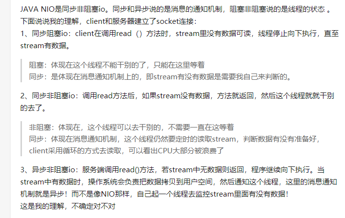
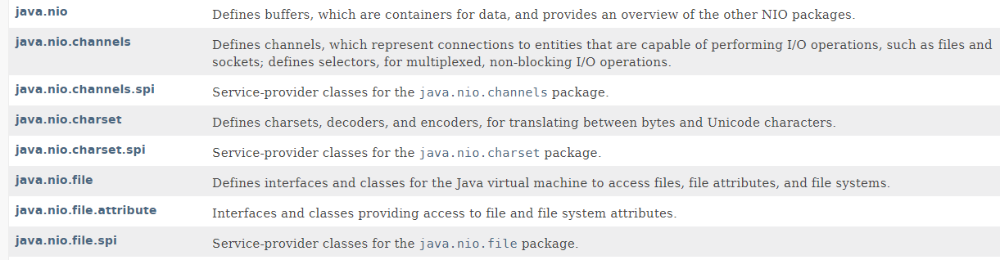
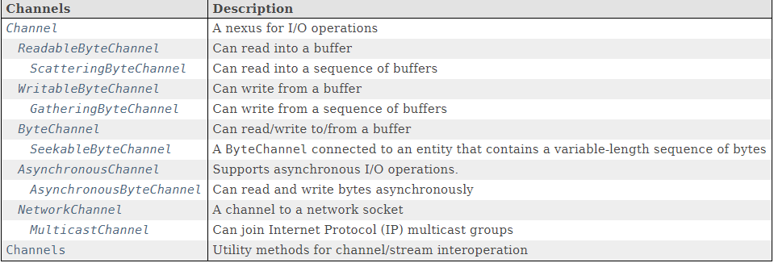
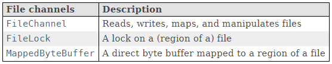
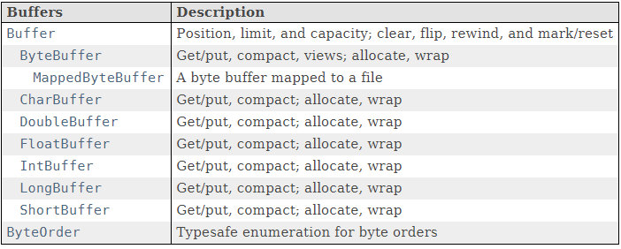
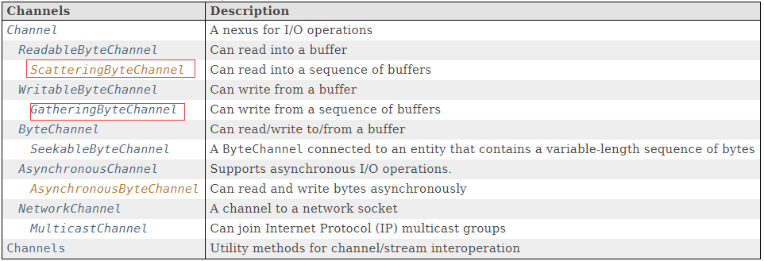
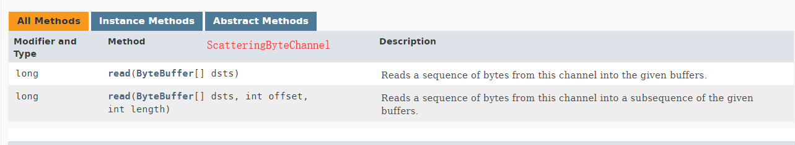

# NIO 概述

## NIO 全称

### 1. java new IO

称为 java new io 是因为 NIO 是 jdk1.4 才引入，于 jdk1.0 的 IO 不同, 官方叫法。

### 2. java non-bloking IO

java 非阻塞 IO。这么 NIO 的特性来叫的。

### 注：

java nio.2 这个意味在原始的 NIO 之上提供了一些的 API。


## 基本概念

### 同步与非同步

* 同步：就是在发出一个调用时，在没有得到结果之前，该调用就不能返回，调用一旦返回，意味着得到了返回值
* 异步：调用发出后，调用立即返回，没有返回结果，被调用者接到通知，计算出结果，通知调用者来取结果。

### 阻塞和非阻塞

阻塞和非阻塞描述的是线程的状态。




​						图1 (引用自 https://www.zhihu.com/question/27991975 [芸芸有度](https://www.zhihu.com/people/yun-yun-you-du) 的回答)


## JDK 中有关 NIO 的包




* java.nio: 定义了 buffers, buffer 用来装数据。java.nio 包提供了一个概览对于其他 NIO 包
* java.nio.chalnnels: 定义 channels， channels 代表实体之间的连接。channels 能执行一些 IO 操作。定义了 selectors，为了复用和非阻塞的 IO 操作。

java.nio.channels.spi 末尾的 spi 代表的是 Service Provider Interface， 是JDK内置的一种服务提供发现机制。一般来说普通程序员不需要管。 

SPI 详细介绍 [SPI解释](https://blog.csdn.net/top_code/article/details/51934459)

java.nio.charset 定义了一些字符集和有关的操作

java.nio.file 是 JDK1.7 加入的，里面新增加了 Files，Path 类，对文件系统操作更加方便。


## channels

channels 初略介绍参考： [channels基础介绍](http://wiki.jikexueyuan.com/project/java-nio-zh/java-nio-channel.html)

以下截图来自 JDK11 文档：






## buffers

[buffers简单介绍](http://wiki.jikexueyuan.com/project/java-nio-zh/java-nio-buffer.html)



示例代码

```java
@Test
public void test0() throws IOException {
        RandomAccessFile randomAccessFile = new RandomAccessFile("abc.txt", "rw"); // throws FileNotFoundException
        FileChannel inChannel = randomAccessFile.getChannel();
        ByteBuffer buf = ByteBuffer.allocate(48);
        int byteRead = inChannel.read(buf);// throws IOException
        while (byteRead != -1){
            System.out.println(byteRead);
            buf.flip();
            while (buf.hasRemaining()){
                System.out.println((char)buf.get());   // 针对 ASCII 字符， 中文用 CharBuffer
            }
            buf.clear();
            byteRead = inChannel.read(buf);
        }
    }
```


## scatter & gather

[scatter & gather 简单介绍](http://wiki.jikexueyuan.com/project/java-nio-zh/java-nio-scatter-gather.html)





```
public abstract class FileChannel
    extends AbstractInterruptibleChannel
    implements SeekableByteChannel, GatheringByteChannel, ScatteringByteChannel
```

例子: 

[GatheringAndScattering-Demo](./code/GatheringAndScattering.java)


还有很多内容就不一一列举了。


## 结尾

学习 nio 过程中觉得有所收获的网页地址列举如下：

[极客学院 nio](http://wiki.jikexueyuan.com/project/java-nio-zh/)

[IBM nio](https://www.ibm.com/developerworks/cn/education/java/j-nio/j-nio.html)

[官方 nio.2介绍](https://docs.oracle.com/javase/tutorial/essential/io/fileio.html)

[bio nio aio 服务器客户端demo](https://blog.csdn.net/anxpp/article/details/51512200)

最后推荐通读一遍官方对于nio 这几个包的介绍

最后增加了一个 BIO, NIO Socket编程的示例。

[BIO](./code/bio) (在nio当前目录的code/bio目录下)

[NIO](./code/nio) (在nio当前目录的code/bio目录下)


## 贡献人员名单

* gl

## CHANGELOG

* v1.0 2018/10/05


