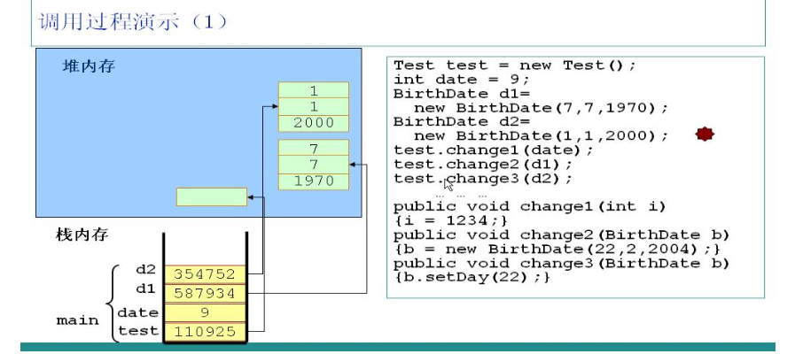
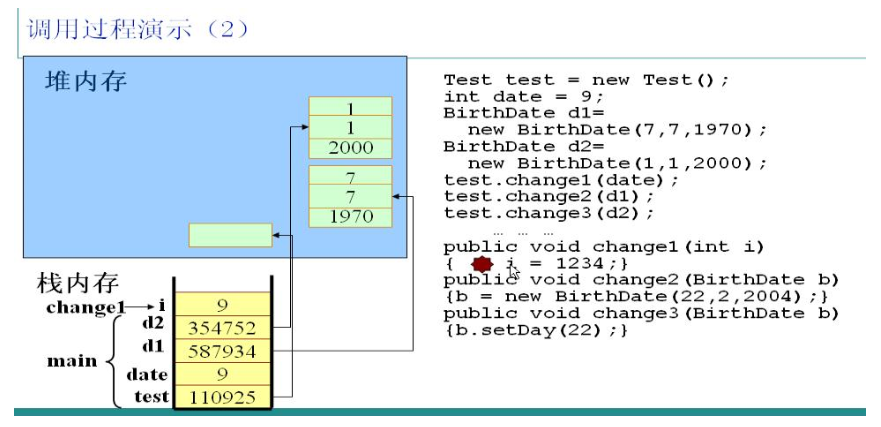
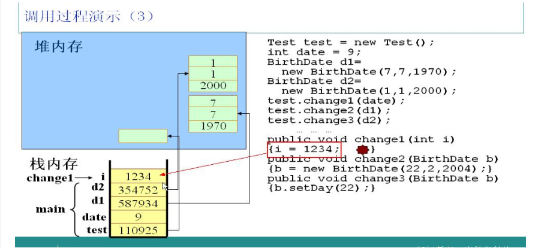
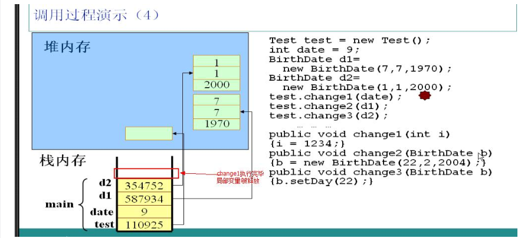
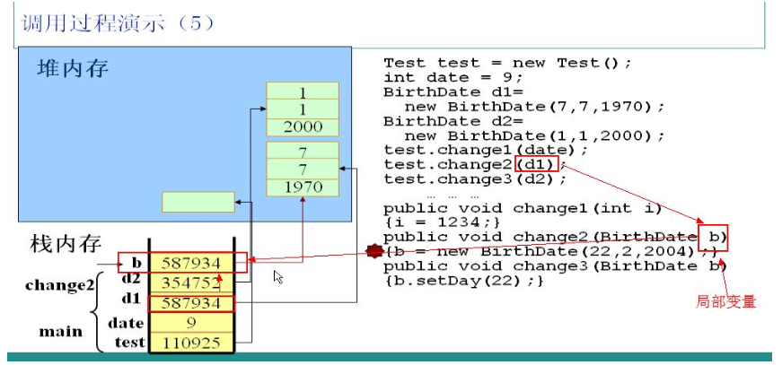
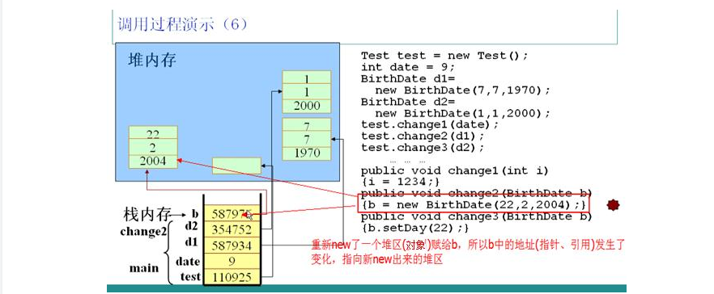
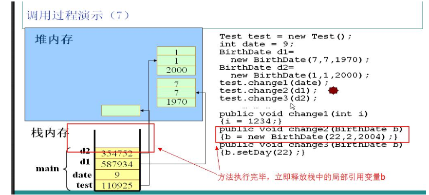
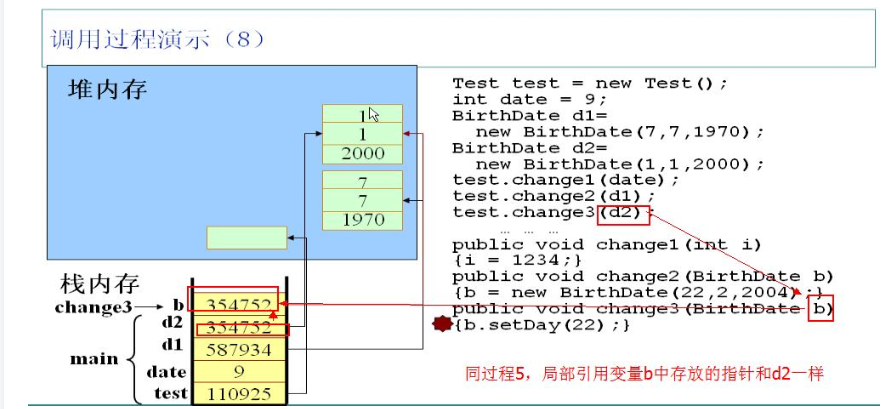
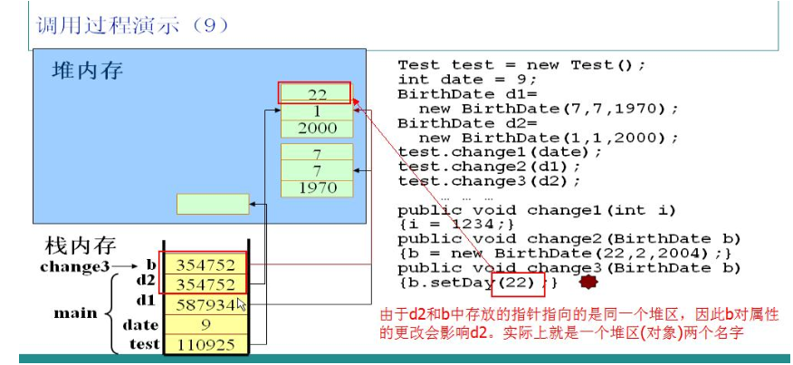
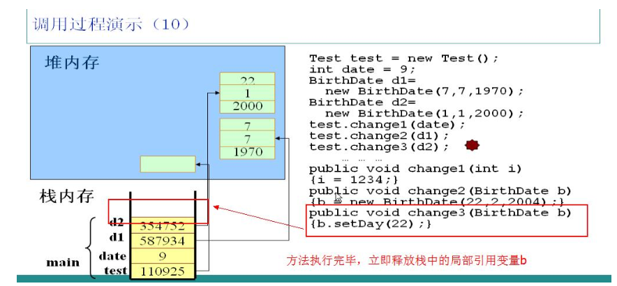

# java内存解析
  
## 一个完整的Java程序运行过程会涉及内存区域
  
* **寄存器**：JVM内部虚拟寄存器，存取速度非常快，程序不可控制。
* **栈**：保存局部变量的值，包括：  
1.用来保存基本数据类型的值；  
2.保存类的实例，即堆区对象的引用(指针)。也可以用来保存加载方法时的帧。  
* **堆**：用来存放动态产生的数据，比如new出来的对象。注意创建出来的对象只包含属于各自的成员变量，并不包括成员方法。因为同一个类的对象拥有各自的成员变量，存储在各自的堆中，但是他们共享该类的方法，并不是每创建一个对象就把成员方法复制一次。  
* **常量池**：JVM为每个已加载的类型维护一个常量池，常量池就是这个类型用到的常量的一个有序集合。包括直接常量(基本类型，String)和对其他类型、方法、字段的符号引用(1)。池中的数据和数组一样通过索引访问。由于常量池包含了一个类型所有的对其他类型、方法、字段的符号引用，所以常量池在Java的动态链接中起了核心作用。常量池存在于堆中  
* **代码段**：用来存放从硬盘上读取的源程序代码。  
* **数据段**：用来存放static定义的静态成员。  
  
## 2.内存划分

  

## 3.代码示例

1.JVM自动寻找main方法，执行第一句代码，创建一个Test类的实例，在栈中分配一块内存，存放一个指向堆区对象的指针110925。
2.创建一个int型的变量date，由于是基本类型，直接在栈中存放date对应的值9。
3.创建两个BirthDate类的实例d1、d2，在栈中分别存放了对应的指针指向各自的对象。他们在实例化时调用了有参数的构造方法，因此对象中有自定义初始值。
  
   
  
调用test对象的change1方法，并且以date为参数。JVM读到这段代码时，检测到i是局部变量，因此会把i放在栈中，并且把date的值赋给i。  

    
  
把1234赋给i。很简单的一步。
  
     
  
change1方法执行完毕，立即释放局部变量i所占用的栈空间。
  
     
  
调用test对象的change2方法，以实例d1为参数。JVM检测到change2方法中的b参数为局部变量，立即加入到栈中，由于是引用类型的变量，所以b中保存的是d1中的指针，此时b和d1指向同一个堆中的对象。在b和d1之间传递是指针。
  
   
  
change2方法中又实例化了一个BirthDate对象，并且赋给b。在内部执行过程是：在堆区new了一个对象，并且把该对象的指针保存在栈中的b对应空间，此时实例b不再指向实例d1所指向的对象，但是实例d1所指向的对象并无变化，这样无法对d1造成任何影响。
  
 

change2方法执行完毕，立即释放局部引用变量b所占的栈空间，注意只是释放了栈空间，堆空间要等待自动回收。
  
  

调用test实例的change3方法，以实例d2为参数。同理，JVM会在栈中为局部引用变量b分配空间，并且把d2中的指针存放在b中，此时d2和b指向同一个对象。再调用实例b的setDay方法，其实就是调用d2指向的对象的setDay方法。
  
  

调用实例b的setDay方法会影响d2，因为二者指向的是同一个对象。
   
  

change3方法执行完毕，立即释放局部引用变量b。  
  
## 贡献人员名单

* [forestMr](https://github.com/forestMr)  
  
## CHANGELOG

*  v1.0 2018/05/30 java内存解析（forestMr） 
