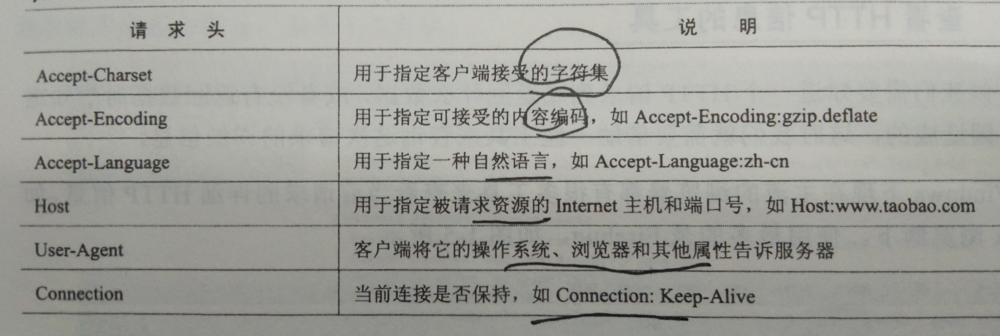
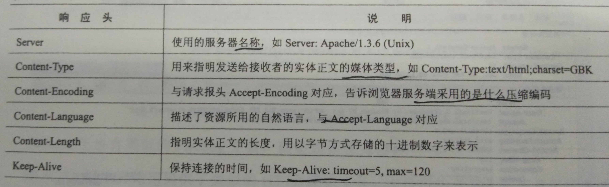
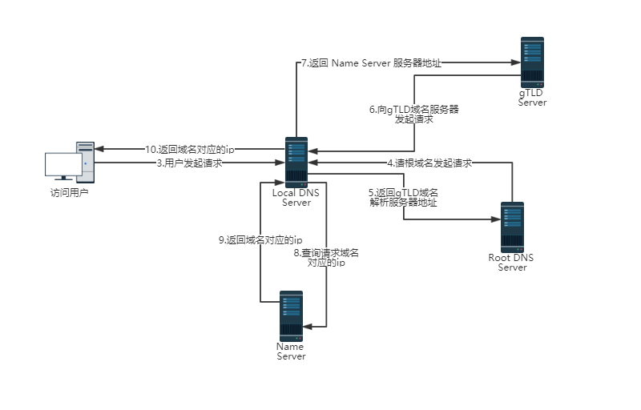
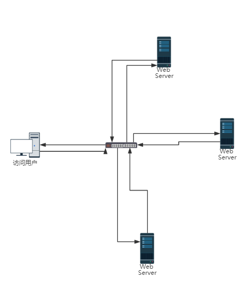

# 深入We请求的过程

## 1 B/S(Browser/Server)网络架构概述

### 1.1 什么是B/S网络架构

  B/S网络架构是浏览器、服务端和Internet网构成的网络结构

### 1.1 B/S架构的好处

* 客服端使用统一的浏览器（Browser）

* 服务端(Server)基于统一的HTTP。和传统的C/S架构使用自定义的应用层协议不同，B/S架构使用的都是统一的HTTP。HTTP协议采用无状态的短连接，大多数传统的C/S互联网应用程序采用长连接交互模式。

## 2 如何发起网络请求

发起一个HTTP请求就相当于建立一个Socket连接。但是outputStream.write写的二进制字节数据格式要符合HTTP。

请求过程如下：

* DNS解析地址栏里输入的url的域名的IP

* Socket再根据IP和默认的80端口与远程服务器建立远程连接

* 浏览器根据这个url组成一个get类型的HTTP请求头，通过outputStream.write发送到目标服务器，
  服务器等待inputStream.read读取数据，最后将数据返回给浏览器。

* 断开连接

 在java程序中可以用例如HttpClient等这类工具包模拟浏览器发送HTTP请求。

## 3 HTTP解析

要理解HTTP，最重要的就是要熟悉HTTP中的HTTP Header，HTTP Header控制着互联网上成千上万的用户的数据的传输。最关键的是，它

控制着用户渲染行为和服务器的执行逻辑。例如，当服务器没有用户请求的数据时就会返回有个404状态码，告诉浏览器没有要请求的数据，

通过浏览器展示一个非常不愿意看到的该页面不存在的错误信息。

常见的HTTP请求头

图1.1

常见的HTTP相应头

图1.2

常见的HTTP状态码

图1.3

## 4 DNS域名解析

* 第一步：浏览器会检查缓存中有没有这个域名对应的解析过的ip地址，如果缓存中有，这个解析过程就将结束。缓存时间几分钟到几个小时不等。域名缓存
时间可以通过TIL属性设置。

* 第二步：如果浏览器缓存中没有，浏览器会查找系统缓存中是否有这个域名对应的DNS解析结果。其实操作系统也会有一个域名解析过程，可以在Windows中通过设置C:\Windows\System32\drivers\etc\hosts文件自定义解析结果。

* 第三步：在local DNS Server缓存中解析，大约80%的域名解析都到这里结束了，所以LDNS主要担任了域名的解析工作。在cmd中通过ipconfig/all 可以查看自己对应的LDNS的ip（如果我们在学校接入互联网，那么LDNS服务器就在学校；如果我们在小区接入互联网，那我DNS就在城市的某个角落）

* 第四步：如果LDNS没有解析成功就直接到Root域名服务器请求解析。

* 第五步：根域名服务器返回本地域名服务器一个所查询的主域名服务器（gTLD Server）地址。gTLD是国际顶级域名服务器，如.com、.cn、.org等，全球只有13台左右。

* 第六步：本地域名服务器向上一步返回的gTLD服务器发送请求。

* 第七步：接收请求的gTLD服务器查找并返回此域名对应的Name Server（注册的域名服务器，例如我们在某个域名服务提供商申请的域名，那么这个域名解析任务就由这个域名提供商的服务器完成）域名服务器的地址。

* 第八步：name Server域名服务器查询存储域名的ip的映射关系表，根据目标ip记录连同TTL值返回给LDNS域名服务器。

* 第九不：返回对应的IP和TTL值，LDNS会缓存这个域名和ip的对应关系，缓存时间由TTL值控制。

* 第十步：把解析的结果返回给用户，用户根据TTL值缓存在本地系统缓存中，域名解析过程结束。

在实际的DNS解析过程中，可能不止这10个步骤，如 Name Server也可能有很多级，或者有一个GTM来负载均衡控制，这都有可能会影响域名解析过程。

流程图

## 5 CDN（Content Delivery Network）工作机制

### 5.1 什么是CDN

CDN是基于内容的分布式分发网络架构

#### 5.11 一般需要CDN服务的网站会选择的组织方案

* 通过租用的[IDC](https://baike.baidu.com/item/IDC%E4%B8%9A%E5%8A%A1/8539781?fr=aladdin "IDC解释")提供额外的CDN服务

* 购买专业的CDN服务商的服务

* 自己组建CDN网络；成本一次增高

### 5.2 CDN出现背景

当下的互联网应用都包含大量的静态内容，但静态内容以及一些准动态内容又是最耗费带宽的，特别是针对全国甚至全世界的大型网站，如果这些请求都指向主站的服务器的话，不仅是主站服务器受不了，单端口500M左右的带宽也扛不住，所以大多数网站都需要CDN服务。由此设计出CDN实现WEB内容的负载均衡，防止出现访问请求热点，延时响应等WEB请求通病。

### 5.3 CDN特点

* 分布式存储

* 通过智能DNS解析或http重定向实现内容分发的负载均衡 

* 全局负载均衡管理与内容管理

### 5.4 CDN网络结构

CDN网络一般分为中心与边缘节点两部分，中心负责全局负载均衡管理与内容管理。

中心节点的功能有：

* 随时监控边缘节点的健康状况（可用性，拥塞程度）

* 根据边缘节点到请求端的距离，以及边缘节点的健康状况，按一定的策略重定向请求

* 与客户主站进行数据同步

### 5.5 CDN工作原理

## 6 负载均衡

### 6.1 什么是负载均衡

负载均衡就是对工作任务进行平衡、分摊到多个操作单元上执行。

### 6.2 负载均衡的好处

* 提高服务器的响应速度及利用效率

* 避免软件或者硬件模块出点单点失效

* 解决网络拥堵问题

### 6.3 三种负载均衡架构

#### 6.31 链路负载均衡

#### 6.32 集群负载均衡

* 硬件负载均衡

硬件负载均衡一般使用一台专门的硬件设备来转发请求

* 软件负载均衡

软件负载均衡解决方案是指在一台或多台服务器相应的操作系统上安装一个或多个附加软件来实现负载均衡，它的优点是基于特定环境，配置简单，使用灵活，成本低廉，可以满足一般的负载均衡需求。

目前比较流行的就三类软件负载均衡，LVS、Nginx和HAProxy。用的最多的还是LVS和Nginx这两种。

1）LVS

平时我们说的LVS是Linux Virtual Server。这当然是基于Linux的开源软件了，这就意味着它是免费的。它基本上能支持所有应用，因为lvs工作在4层，所以它可以对几乎所有应用做 负载均衡，包括http、数据库、聊天室等等。同时，若跟硬件负载均衡相比它的缺点也不容忽视，LVS要求技术水平很高，操作上也比较复杂，配置也很繁 琐，没有赖以保障的服务支持，稳定性来说也相对较低（人为和网络环境因素更多一些）。

2) Nginx

在这里，我们介绍Nginx就需要跟LVS来对比了。LVS是工作在第四层，对网络的依赖性相对较大。然而Nginx是工作在第七层，对于网络的依 赖性就小的多。与LVS相比，Nginx的安装和配置也相对简单一些，另外测试方面也更简单，主要还是因为对网络依赖性小的缘故。Nginx有一点不好的 就是应用要比LVS少。一般我们做软件负载均衡的时候，通常会先考虑LVS，但是遇到比较复杂的网络环境时，用LVS可能会遇到很多麻烦，不妨就考虑尝试 一下Nginx。

3) HAProxy

使用HAProxy的人非常少，对其了解的也不多。通过官方的了解，HAProxy提供高可用性、负载均衡以及基于TCP和HTTP应用的代理，支 持虚拟主机，它是免费、快速并且可靠的一种解决方案。HAProxy特别适用于那些负载特大的web站点，这些站点通常又需要会话保持或七层处理。（据说 是可以工作在4-7层的。）并且它的运行模式使得它可以很简单安全的整合进您当前的架构中，同时可以保护你的web服务器不被暴露到网络上。

#### 6.33 操作系统负载均衡

操作系统负载均衡是利用操作操作系统级别的软中断或者硬件中断来达到负载均衡。

## 贡献人员名单

名单按照字母顺序排序。

* [forestMr](https://github.com/forestMr)

## CHANGELOG

* v1.0 2018/09/24 web请求过程（forestMr）