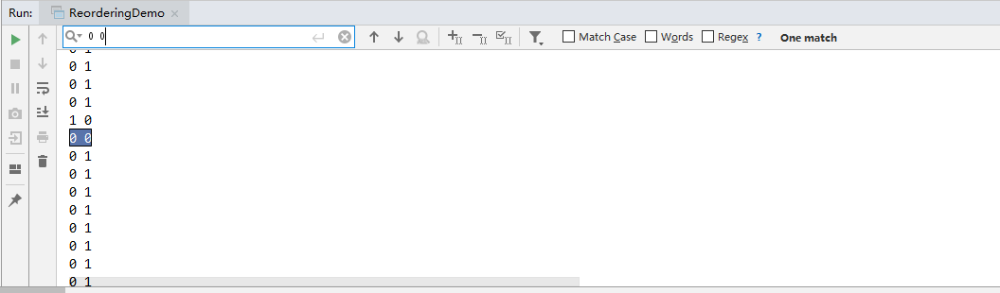
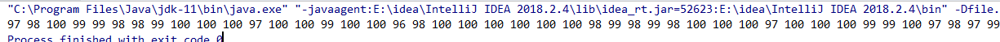

# 浅析 volatile

首先先查看程序1：

```java
public class ReorderingDemo {
    static int x = 0, y = 0, a = 0, b = 0;
    public static void main(String[] args) throws Exception {
        for (int i = 0; i < 100000; i++) {
            x=y=a=b=0;
            Thread one = new Thread() {
                public void run() {
                    a = 1;
                    x = b;
                }
            };
            Thread two = new Thread() {
                public void run() {
                    b = 1;
                    y = a;
                }
            };
            one.start();
            two.start();

            one.join();
            two.join();
            System.out.println(x + " " + y);
        }
    }
}
```

输出结果可能有哪些呢？ `0 0` , `0 1`, `1 0`, `1 1`

分析这段代码功能：线程一将 a置1 同时令变量 x = b, 线程二 将b置1，并令 y = a, 令主程序等待, 然后输出a,b的值。

因为线程具有异步性，分析如下几种运行情况：

1. 线程 one 先执行并直接运行结束，然后线程 two 执行， 输出结果为： 0 1
2. 线程 two 先执行并直接运行结束，然后线程 one 执行， 输出结果为： 1 0
3. 线程 one 执行到 `a = 1` 切换到线程 two 运行, 那么输出结果为 1 1

因为主线程等待线程 one, two 执行完之后在执行，所以逻辑上应该认为 `0 0` 结果是不可能的。

运行该段程序，查看输出结果是否如我们所料。



可以发现输出结果中居然有 `0 0`

我们理智分析为什么会出现这种结果，原因和计算机的体系结构有关。

> 因为计算机是以CPU为核心，为了缓和CPU和主存的运行速度的差异，引入了许多中间存储部件，如寄存器，cache。也就是说一份数据可能在几个地方存放着。

也就是说 `0 0`出现的原因：线程 one 修改了变量 a=1, 线程 two 也设置了 b=1, 也给 x, y 变量赋值了，但是赋值的地方是寄存器或者cache中，并没有将结果写到主存中，主存的 x, y 变量的值还是 0。线程 one, two 执行完之后，main 线程执行，直接输出了主存的值。

这也称做指令重排序现象。为了提高程序的运行速度，编译器和处理器可能会对操作进行指令重排序。

*as-if-serial*语义：不管指令怎么重排序，单线程的执行结果不能改变。编译器,runtime 和处理器都遵循*as-if-serial*语义。为了遵守as-if-serial语义，编译器和处理器不会对存在数据依赖关系的操作做重排序，因为这种重排序会改变执行结果。但是，如果操作之间不存在数据依赖关系，这些操作可能被编译器和处理器重排序。 

指令重排序对上面这段程序的影响就是本该在线程 one 和线程 two 对 x,y 赋值之后写入主存的操作被延后到主线程输出 x,y的值之后。

`0 0`不是我们预料中的结果，也就是说该段多线程程序是错误的，我们要如何修改呢？

我们可以给x,y,a,b变量加上 volatile 变量，即

```java
static volatile int x = 0, y = 0, a = 0, b = 0;
```

我们就再也看不见结果为 `0 0`的了。

**为什么给变量加上volatile声明之后，问题就解决了呢？**

把变量声明为volatile类型后，编译器与运行时都会注意到这个变量是多个线程共享的，因此不会对变量上的操作与其他内存操作重排序。也就是说volatile变量不会被缓存到存储器或者对其他处理器不可见的地方。因此在读取volatile变量时总会返回最新写入的值，所以说volatile变量保证了可见性。

到这里不得不提一下**happen-before法则**

**happen-before法则具有如下性质**

1. 同一线程中每个Action都happen-before于出现在其后的Action
2. 对一个监视器的解锁happen-before于对监视器的加锁
3. 对volatile变量的写操作happen-before于后续对该变量的读操作。
4. Thread.start() 会happen-before 于启动线程里面的操作
5. Thread中所有动作都happen-before于其他线程检测到此线程结束
6. 线程A调用另一线程B的interrupt() happen-before 于线程A发现B被A中断。
7. 一个对象构造函数的结束happen-before 于该对象的finalize开始。
8. 如果A 动作 happen-before 于 B动作，B动作happen-before 于C动作，那么A动作happen-before于C动作。

也就是说happen-before 法则保证了volatile的可见性。

对于上面的程序1来说，happen-before法则起了效果，保证了从寄存器写入x,y的值到主存happen-before于主线程读取x,y的值。

**我们什么时候才该使用volatile?**

当volatile满足如下所列的所有条件时才应该使用volatile。

1. 对变量的写入操作不依赖变量的当前值, 或者你能确保只有单个线程更新变量的值。
2. 该变量不会与其他状态变量一起纳入不变性条件中。
3. 在访问变量时不需要加锁。

如何理解不变性条件，如对一个因式分解程序来说，a=8, b=[2,2,2]，若a = 9, 那么b[3, 3]。

即a与b是一对一的，那么如果a的值变了，b的值也必须跟着变。a,b两个变量构成了不变性条件。

如果不遵循上述条件，那么要么volatile加了可能并不能达到你想要的效果。

**理解上述三条规则**

如程序2所示，我们的对于该程序的期待是每一个线程对于i 都有可见性，那么100个线程来执行i++,那么100个线程加了之后i的值就是100。

```java
public class AtomicTest {
    static int i=0;
    static ArrayList<Integer> list = new ArrayList<>();
    public static void main(String[] args) throws InterruptedException {
        Lock lock = new ReentrantLock();
        Runnable r1 = ()->{
            try {
                TimeUnit.MILLISECONDS.sleep(1);
                i++;
            } catch (InterruptedException e) {
                e.printStackTrace();
            }
        };
        ArrayList<Thread> threads = new ArrayList<>();
        for (int k = 0; k < 100; k++) {
            for (int j = 0; j < 100; j++) {
                var t = new Thread(r1);
                threads.add(t);
                t.start();
            }

            for (Thread t1: threads) {
                t1.join();
            }
            System.out.println(i);
            i=0;
        }
    }
}
```

我们查看程序2的执行结果:



该程序并不符合我们的预期，也就是说该段程序是错误的。

为什么呢，该程序违反了上述规则的1，写入操作与当前变量的值有关。也就是说在没写变量之前，其他线程已经把变量读入了，写了变量只是对后续的线程来读取值保持可见性。

理解规则二，不变性条件的变化涉及到的是复合操作，也就是说把复合操作变为原子操作，也就是说给复合操作涉及到的变量加上volatile修饰，很明显也是不能达到我们把复合操作的目的，所以也不建议加上volatile修饰，应该用锁来保证原子操作。

理解规则三，如果在访问变量（读或写）时加锁，锁已经保证了同步和可见性，加上volatile就是画蛇添足。

**volatile变量使用场景举例**

场景1：

```java
volatile boolean asleep;
...
while(!asleep){
    countSomethingSleep();
}
```

即其他线程等待某个线程去修改 asleep 变量的值。

场景2：

```java
public class CopyOnWriteArrayList<E>
    implements List<E>, RandomAccess, Cloneable, java.io.Serializable {
    final transient Object lock = new Object();
    private transient volatile Object[] array;

    final Object[] getArray() {
        return array;
    }
    final void setArray(Object[] a) {
        array = a;
    }
}
```

使用了volatile，在多线程环境中get,set方法就不需要同步了，如果没使用volatile, get,set方法就无法保证可见性，所以就要使用同步，开销比volatile大。

## 参考文献

* Java并发编程实战
* [深入浅出 Java Concurrency](http://www.blogjava.net/xylz/archive/2010/07/08/325587.html)


## 贡献人员名单

* GL

