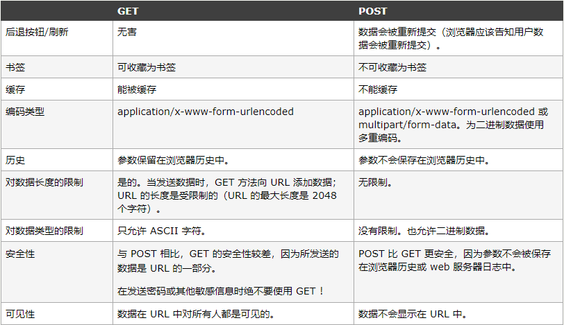
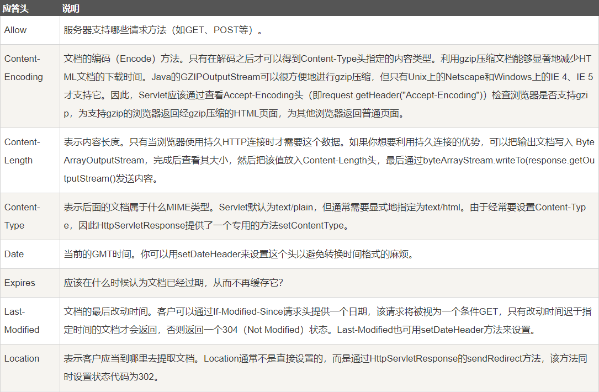
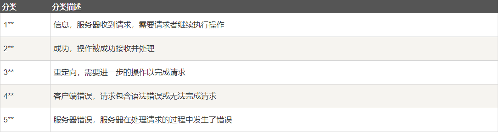
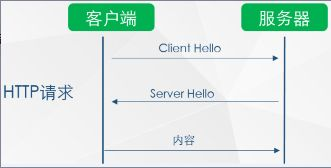
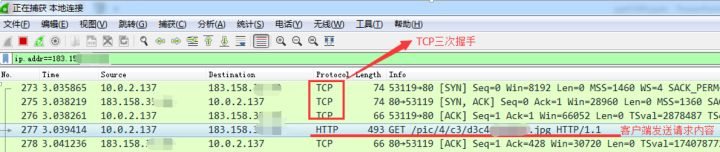
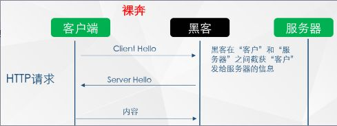
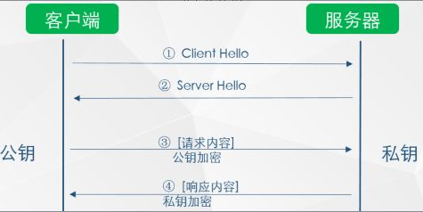
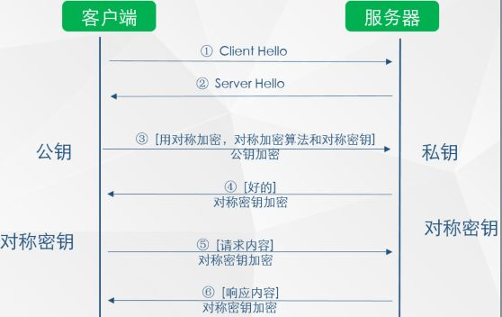
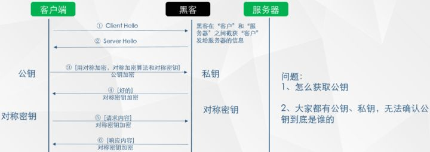
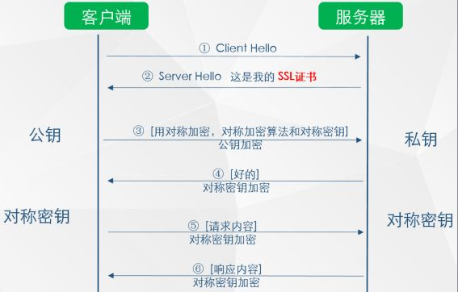

# HTTP & HTTPS

## HTTP 协议

### HTTP 简介

**HTTP协议** 是超文本传输协议（Hyper Text Transfer Protocol）的缩写，是用于从万维网服务器传输超文本到本地浏览器的传送协议。
**HTTP** 是一个基于 **TCP/IP** 通信协议来传递数据。
HTTP 协议工作于客户端 - 服务器构架之上。浏览器作为 HTTP 客户端通过 URL 向 HTTP 服务端即 WEB 服务器发送所有请求。 WEB服务器根据收到的请求后，向客户端发送相应信息。

#### HTTP 三点注意事项

* HTTP是无连接：无连接的含义是限制每次连接只处理一个请求。服务器处理完客户的请求，并收到客户的应答后，即断开连接。采用这种方式可以节省传输时间。
* HTTP是媒体独立的：这意味着，只要客户端和服务器知道如何处理的数据内容，任何类型的数据都可以通过HTTP发送。
* HTTP是无状态：HTTP协议是无状态协议。无状态是指协议对于事务处理没有记忆能力。缺少状态意味着如果后续处理需要前面的信息，则它必须重传，这样可能导致每次连接传送的数据量增大。另一方面，在服务器不需要先前信息时它的应答就较快。<br/>


### HTTP 消息结构

#### 客户端请求信息

**客户端发送一个HTTP请求到服务器的请求消息包括以下格式：请求行（request line）、请求头部（header）、空行和请求数据四个部分组成**<br/>
<br/>
例如：

```
GET /hello.txt HTTP/1.1
User-Agent: curl/7.16.3 libcurl/7.16.3 OpenSSL/0.9.71 zlib/1.2.3
Host: www.example.com
Accept-Language: en
```

#### 服务器响应消息

HTTP响应也由四个部分组成，分别是：状态行、消息报头、空行和响应正文
例如：

```
HTTP/1.1 200 OK
Date: Sun, 24 Sep 2018 12:00:00 GMT
Last-Modified: Web, 22 Sep 2018 12:00:00 GMT
ETag: "34aa387-d-1568eb00"
Accept-Ranges: bytes
Content-Length: 51
Vary: Accept-Encoding
Content-Type: text/plain
```

### HTTP 请求方法

根据HTTP标准，HTTP请求可以使用多种请求方法。
HTTP1.0定义了三种请求方法： GET, POST 和 HEAD方法。
HTTP1.1新增了五种请求方法：OPTIONS, PUT, DELETE, TRACE 和 CONNECT 方法。

#### GET 与 POST

在客户机和服务器之间进行请求 - 响应时，两种最常用到的方法时：GET 和 POST。
GET - 从指定的资源请求数据
POST - 向指定的资源提交要被处理的数据

**GET 方法**

查询字符串（名称/键值对）是在 GET 请求的 URL 中发送：

```
/test/demo_form.jsp?name1=value&name2=value2
```

* GET 请求可被缓存
* GET 请求保留在浏览器历史记录中
* GET 请求可被收藏为书签
* GET 请求不应在处理敏感数据时使用
* GET 请求有长度限制
* GET 请求只应当用于取回数据
 
**关于长度限制**，详情[请点击](https://blog.csdn.net/a460550542/article/details/72511343)

**POST 方法**

查询字符串（名称/值对）是在 POST 请求的 HTTP 消息主体中发送的：

```
POST /test/demo_form.jsp HTTP/1.1
Host: 127.0.0.1
name1=value1&name2=value2
```

* POST 请求不会被缓存
* POST 请求不会保留在浏览器历史记录中
* POST 不能被收藏为书签
* POST 请求对数据长度没有要求<br/>
<br/>


### HTTP 响应头信息

HTTP 部分响应头信息：<br/>
<br/>

### HTTP 状态码

当浏览者访问一个网页时，浏览者的浏览器会向网页所在服务器发出请求。当浏览器接收并显示网页前，此网页所在的服务器会返回一个包含HTTP状态码的信息头（server header）用以响应浏览器的请求。HTTP状态码的英文为HTTP Status Code。
下面是常见的HTTP状态码：
* 200 - 请求成功
* 301 - 资源（网页等）被永久转移到其它URL
* 404 - 请求的资源（网页等）不存在
* 500 - 内部服务器错误
**HTTP 状态码分类**<br/>
<br/>


## HTTPS

**HTTPS** （Hyper Text Transfer Protocol over Secure Socket Layer），近几年国内外大型的互联网公司很多都启用了全站 HTTPS， 这说明在未来 HTTPS 将有很大的发展。为鼓励全球网站使用 HTTPS，一些互联网公司都提出了自己的要求：
1. Google 已调整搜索引擎算法，让采用 HTTPS 的网站在搜索结果中排名更靠前；
1. 从 2017 年开始，Google Chrome 浏览器已把采用 HTTP 协议的网站标记为不安全网站；
1. 苹果公司要求 2017 年 APP Store 中的所有应用都必须使用 HTTPS 加密连接；
1. 当前国内炒得很火的微信小程序也要求必须使用 HTTPS 协议；
1. 新一代的 HTTP/2 协议的支持需以 HTTPS 为基础。

### 协议

HTTPS 可以理解为 HTTP + SSL/TLS，即 HTTP 下加入 SSL 层， HTTPS 的安全基础是 SSL，因此加密的详细内容就需要用 SSL，用于安全的 HTTP 数据传输。<br/>
<br/>


### 加密算法

1. **对称加密**
    有流式、分组两种，加密和解密都是使用的同一个密钥。
    例如：DES、AES-GCM、CharChar20-Poly 1305 等

1. **非对称加密**
    加密使用的密钥和解密使用的密钥是不相同的，分别称为：公钥、私钥，公钥和算法都是公开的，私钥是保密的。非对称加密算法性能较低，但是安全性超强，由于其加密特性，非对称加密算法能加密的数据长度也是有限的。
    例如：RSA、DSA、ECDSA、 DH、ECDHE

3. **哈希算法**
    将任意长度的信息转换为较短的固定长度的值，通常其长度要比信息小得多，且算法不可逆。
    例如：MD5、SHA-1、SHA-2、SHA-256 等

4. **数字签名**
    签名就是在信息的后面再加上一段内容（信息经过hash后的值），可以证明信息没有被修改过。hash值一般都会加密后（也就是签名）再和信息一起发送，以保证这个hash值不被修改。

### HTTP 访问过程

<br/>

抓包如下：<br/>
<br/>

如上图所示，HTTP请求过程中，客户端与服务器之间没有任何身份确认的过程，数据全部明文传输，“裸奔”在互联网上，所以很容易遭到黑客的攻击，如下：<br/>
<br/>

可以看到，客户端发出的请求很容易被黑客截获，如果此时黑客冒充服务器，则其可返回任意信息给客户端，而不被客户端察觉，所以我们经常会听到一词“劫持”，现象如下：
下面两图中，浏览器中填入的是相同的URL，左边是正确响应，而右边则是被劫持后的响应<br/>
<br/>

所以 HTTP 传输面临的风险有：
1. 窃听风险：黑客可以获知通信内容。
2. 篡改风险：黑客可以修改通信内容。
3. 冒充风险：黑客可以冒充他人身份参与通信。

### HTTP 向 HTTPS 演化的过程

第一步：为了防止上述现象的发生，人们想到一个办法：对传输的信息加密（即使黑客截获，也无法破解）<br/>
<br/>

如上图所示，此种方式属于对称加密，双方拥有相同的密钥，信息得到安全传输，但此种方式的缺点是：
* 不同的客户端、服务器数量庞大，所以双方都需要维护大量的密钥，维护成本很高
* 因每个客户端、服务器的安全级别不同，密钥极易泄露

第二步：既然使用对称加密时，密钥维护这么繁琐，那我们就用非对称加密试试<br/>
<br/>

如上图所示，客户端用公钥对请求内容加密，服务器使用私钥对内容解密，反之亦然，但上述过程也存在缺点：
* 公钥是公开的（也就是黑客也会有公钥），所以第 ④ 步私钥加密的信息，如果被黑客截获，其可以使用公钥进行解密，获取其中的内容

第三步：非对称加密既然也有缺陷，那我们就将对称加密，非对称加密两者结合起来，取其精华、去其糟粕，发挥两者的各自的优势<br/>
<br/>
如上图所示

1. 第 ③ 步时，客户端说：（咱们后续回话采用对称加密吧，这是对称加密的算法和对称密钥）这段话用公钥进行加密，然后传给服务器
2. 服务器收到信息后，用私钥解密，提取出对称加密算法和对称密钥后，服务器说：（好的）对称密钥加密
3. 后续两者之间信息的传输就可以使用对称加密的方式了
遇到的问题：
    1. 客户端如何获得公钥
    2. 如何确认服务器是真实的而不是黑客<br/>
<br/>

第四步：获取公钥与确认服务器身份
1. 获取公钥
    1. 提供一个下载公钥的地址，回话前让客户端去下载。（缺点：下载地址有可能是假的；客户端每次在回话前都先去下载公钥也很麻烦）
    2. 回话开始时，服务器把公钥发给客户端（缺点：黑客冒充服务器，发送给客户端假的公钥）

2. 那有木有一种方式既可以安全的获取公钥，又能防止黑客冒充呢？ 那就需要用到终极武器了：SSL 证书（申购）<br/>
<br/>

* 如上图所示，在第 ② 步时服务器发送了一个SSL证书给客户端，SSL 证书中包含的具体内容有：
    1. 证书的发布机构CA
    2. 证书的有效期
    3. 公钥
    4. 证书所有者
    5. 签名

3. 客户端在接受到服务端发来的SSL证书时，会对证书的真伪进行校验，以浏览器为例说明如下：
    1. 首先浏览器读取证书中的证书所有者、有效期等信息进行一一校验
    2. 浏览器开始查找操作系统中已内置的受信任的证书发布机构CA，与服务器发来的证书中的颁发者CA比对，用于校验证书是否为合法机构颁发
    3. 如果找不到，浏览器就会报错，说明服务器发来的证书是不可信任的。
    4. 如果找到，那么浏览器就会从操作系统中取出 颁发者CA 的公钥，然后对服务器发来的证书里面的签名进行解密
    5. 浏览器使用相同的hash算法计算出服务器发来的证书的hash值，将这个计算的hash值与证书中签名做对比
    6. 对比结果一致，则证明服务器发来的证书合法，没有被冒充
    7. 此时浏览器就可以读取证书中的公钥，用于后续加密了
4. 所以通过发送SSL证书的形式，既解决了公钥获取问题，又解决了黑客冒充问题，一箭双雕，HTTPS加密过程也就此形成

所以相比HTTP，HTTPS 传输更加安全
    1. 所有信息都是加密传播，黑客无法窃听。
    2. 具有校验机制，一旦被篡改，通信双方会立刻发现。
    3. 配备身份证书，防止身份被冒充。


## 贡献人员名单

名字按字母顺序排序

* [coolzhang666](https://github.com/coolzhang666)

## CHANGELOG

* v1.0 2018/09/24 初版