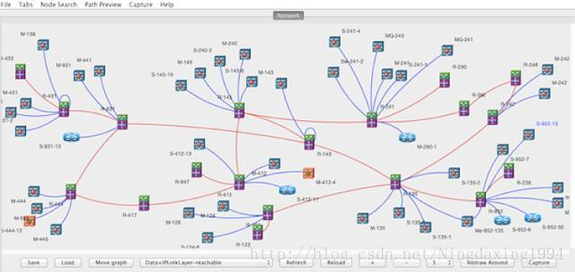
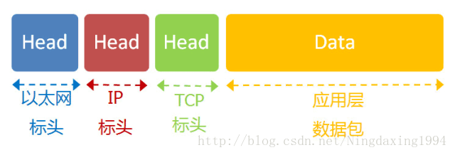
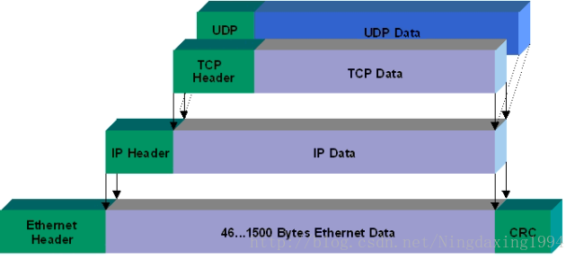
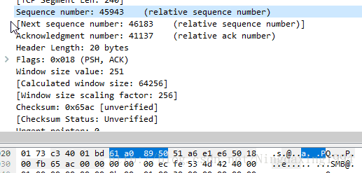
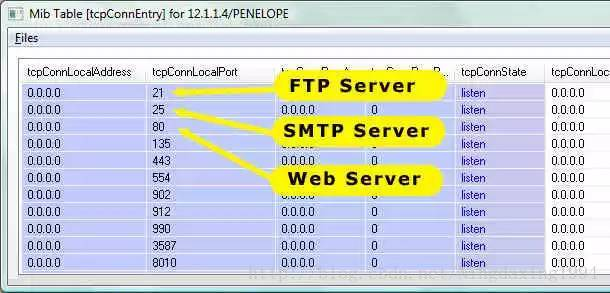
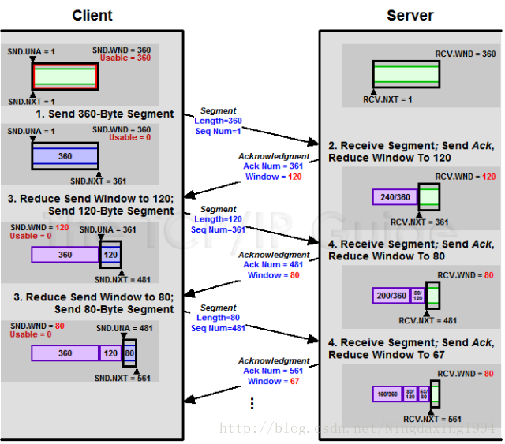
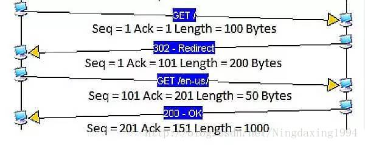
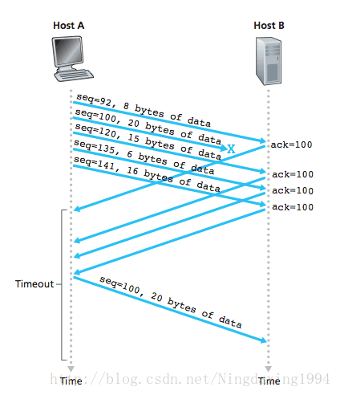

# 
 UDP_TCP
## 一、UDP:User Datagram Protocol-------用户数据报协议
&nbsp;&nbsp;&nbsp;&nbsp;UDP是面向无连接的用户数据报协议，在传输数前不需要先建立连接。可以进行广播、多播

## 二、TCP:Transmission Control Protocol--------传输控制协议

&nbsp;&nbsp;&nbsp;&nbsp;TCP是面向连接的传输控制协议，使用三次握手协议建立连接。
* 区别
    * 1、TCP面向连接（如打电话要先拨号建立连接）;UDP是无连接的，即发送数据之前不需要建立连接
    * 2、TCP提供可靠的服务。也就是说，通过TCP连接传送的数据，无差错，不丢失，不重复，且按序到达;UDP尽最大努力交付，即不保证可靠也不保证交付
    * 3、TCP通过校验和，重传控制，序号标识，滑动窗口、确认应答实现可靠传输。如丢包时的重发控制，还可以对次序乱掉的分包进行顺序控制。
    * 4、TCP对系统资源要求较多，UDP对系统资源要求较少。
* TCP协议的作用

TCP是以太网协议和ip协议的上层协议，也是应用层协议的下层协议，

最底层的以太网协议规定了电子信号如何组成数据包，解决了子网内部的点对点通信。

但是以太网协议不能解决多个局域网如何互通，这由ip协议解决。

ip协议定义了一套自己的地址规则，称为ip地址。它实现了路由功能，允许局域网的A主机，向另一个局域网的B主机发送信息

ip协议只是一个地址协议，并不保证数据包的完整。如果路由器丢包（比如缓存满了，新进来的数据就会丢失），就需要发现丢了哪一个包，以及如何重新发送这个包。这就要依赖TCP协议。
简单说，TCP协议的作用是保证数据通信的完整性和可靠性，防止丢包。

* TCP数据包的大小

以太网数据包（packet）的大小是固定的,最初是1518字节，后来增加到1522字节。其中， 1500 字节是负载（payload），22字节是头信息（head）。

IP 数据包在以太网数据包的负载里面，它也有自己的头信息，最少需要20字节，所以 IP 数据包的负载最多为1480字节。

（图片说明：IP 数据包在以太网数据包里面，TCP 数据包在 IP 数据包里面。）

TCP 数据包在 IP 数据包的负载里面。它的头信息最少也需要20字节，因此 TCP 数据包的最大负载是 1480 - 20 = 1460 字节。由于 IP 和 TCP 协议往往有额外的头信息，所以 TCP 负载实际为1400字节左右。
因此，一条1500字节的信息需要两个 TCP 数据包。HTTP/2 协议的一大改进， 就是压缩 HTTP 协议的头信息，使得一个 HTTP 请求可以放在一个 TCP 数据包里面，而不是分成多个，这样就提高了速度。

（图片说明：以太网数据包的负载是1500字节，TCP 数据包的负载在1400字节左右。）

* TCP数据包的编号（SEQ）
一个包1400字节，那么一次性发送大量数据，就必须分成多个包。比如，一个 10MB 的文件，需要发送7100多个包。
发送的时候，TCP 协议为每个包编号（sequence number，简称 SEQ），以便接收的一方按照顺序还原。万一发生丢包，也可以知道丢失的是哪一个包。
第一个包的编号是一个随机数。为了便于理解，这里就把它称为1号包。假定这个包的负载长度是100字节，那么可以推算出下一个包的编号应该是101。这就是说，每个数据包都可以得到两个编号：自身的编号，以及下一个包的编号。接收方由此知道，应该按照什么顺序将它们还原成原始文件。

（图片说明：当前包的编号是45943，下一个数据包的编号是46183，由此可知，这个包的负载是240字节。）

* 4、TCP数据包的组装
收到 TCP 数据包以后，组装还原是操作系统完成的。应用程序不会直接处理 TCP 数据包。
对于应用程序来说，不用关心数据通信的细节。除非线路异常，收到的总是完整的数据。应用程序需要的数据放在 TCP 数据包里面，有自己的格式（比如 HTTP 协议）。
TCP 并没有提供任何机制，表示原始文件的大小，这由应用层的协议来规定。比如，HTTP 协议就有一个头信息Content-Length，表示信息体的大小。对于操作系统来说，就是持续地接收 TCP 数据包，将它们按照顺序组装好，一个包都不少。
操作系统不会去处理 TCP 数据包里面的数据。一旦组装好 TCP 数据包，就把它们转交给应用程序。TCP 数据包里面有一个端口（port）参数，就是用来指定转交给监听该端口的应用程序。

图片说明：系统根据 TCP 数据包里面的端口，将组装好的数据转交给相应的应用程序。上图中，21端口是 FTP 服务器，25端口是 SMTP 服务，80端口是 Web 服务器。）
应用程序收到组装好的原始数据，以浏览器为例，就会根据 HTTP 协议的Content-Length字段正确读出一段段的数据。这也意味着，一次 TCP 通信可以包括多个 HTTP 通信。

* 5、慢启动和ACK
服务器发送数据包，当然越快越好，最好一次性全发出去。但是，发得太快，就有可能丢包。带宽小、路由器过热、缓存溢出等许多因素都会导致丢包。线路不好的话，发得越快，丢得越多。
最理想的状态是，在线路允许的情况下，达到最高速率。但是我们怎么知道，对方线路的理想速率是多少呢？答案就是慢慢试。
TCP 协议为了做到效率与可靠性的统一，设计了一个慢启动（slow start）机制。开始的时候，发送得较慢，然后根据丢包的情况，调整速率：如果不丢包，就加快发送速度；如果丢包，就降低发送速度。
Linux 内核里面设定了（常量TCP_INIT_CWND），刚开始通信的时候，发送方一次性发送10个数据包，即”发送窗口”的大小为10。然后停下来，等待接收方的确认，再继续发送。
默认情况下，接收方每收到两个 TCP 数据包，就要发送一个确认消息。”确认”的英语是 acknowledgement，所以这个确认消息就简称 ACK。
ACK 携带两个信息。
期待要收到下一个数据包的编号

发送方有了这两个信息，再加上自己已经发出的数据包的最新编号，就会推测出接收方大概的接收速度，从而降低或增加发送速率。这被称为”发送窗口”，这个窗口的大小是可变的。

（图片说明：每个 ACK 都带有下一个数据包的编号，以及接收窗口的剩余容量。双方都会发送 ACK。）
注意，由于 TCP 通信是双向的，所以双方都需要发送 ACK。两方的窗口大小，很可能是不一样的。而且 ACK 只是很简单的几个字段，通常与数据合并在一个数据包里面发送。

图片说明：上图一共4次通信。第一次通信，A 主机发给B 主机的数据包编号是1，长度是100字节，因此第二次通信 B 主机的 ACK 编号是 1 + 100 = 101，第三次通信 A 主机的数据包编号也是 101。同理，第二次通信 B 主机发给 A 主机的数据包编号是1，长度是200字节，因此第三次通信 A 主机的 ACK 是201，第四次通信 B 主机的数据包编号也是201。）
即使对于带宽很大、线路很好的连接，TCP 也总是从10个数据包开始慢慢试，过了一段时间以后，才达到最高的传输速率。这就是 TCP 的慢启动。

* 数据包的遗失处理
TCP 协议可以保证数据通信的完整性，这是怎么做到的？
前面说过，每一个数据包都带有下一个数据包的编号。如果下一个数据包没有收到，那么 ACK 的编号就不会发生变化。
举例来说，现在收到了4号包，但是没有收到5号包。ACK 就会记录，期待收到5号包。过了一段时间，5号包收到了，那么下一轮 ACK 会更新编号。如果5号包还是没收到，但是收到了6号包或7号包，那么 ACK 里面的编号不会变化，总是显示5号包。这会导致大量重复内容的 ACK。
如果发送方发现收到三个连续的重复 ACK，或者超时了还没有收到任何 ACK，就会确认丢包，即5号包遗失了，从而再次发送这个包。通过这种机制，TCP 保证了不会有数据包丢失。

（图片说明：Host B 没有收到100号数据包，会连续发出相同的 ACK，触发 Host A 重发100号数据包。）

##三、UDP的实现：类DatagramSocket、Datagrampacket
* 1、客户端：
    * 1）、创建客户端，DatagramSocket类
    * 2）、准备数据、字节数组
    * 3）、打包DatagramPacket +服务器地址及端口
    * 4）、发送、释放资源
* 2、服务端
    * 1）、创建服务器 DatagramSocket 类+指定端口
    * 2）、准备容器接收字节数据，封装 DatagramPacket
    * 3) 、接收数据
    * 4）、分析、释放资源

##四、TCP的实现：类ServerSocket和Socket类
* 1、客户端：
    * 1）、Socket类，创建管道，确定地址以及开放的端口---socket(URL,port)
    * 2）、获取输出流和输入流---getOutputStream()\getInputStream()
    * 3）、读取数据\写入数据
    * 4）、关闭流
* 2、服务端：
    * 1）、类ServerSocket创建服务端，并指定端口---ServerSocket(port)
    * 2）、打开管道---Socket()
    * 3）、获取输入输出流
    * 4）、接收数据
    * 5）、关闭流

##五、基于TCP协议的聊天室构建
* 1、实现服务端
* 2、创建内部线程类---TCP_Server_Channel
* 3、创建客户端
* 4、创建发送线程类---TCP_Send_Runable
* 5、创建接收线程类---TCP_Receive_Runable

##六、贡献人员名单
* [1997Gongquan](https://github.com/1997Gongquan)

##CHANGELOG
* 2018.12.16、初稿
